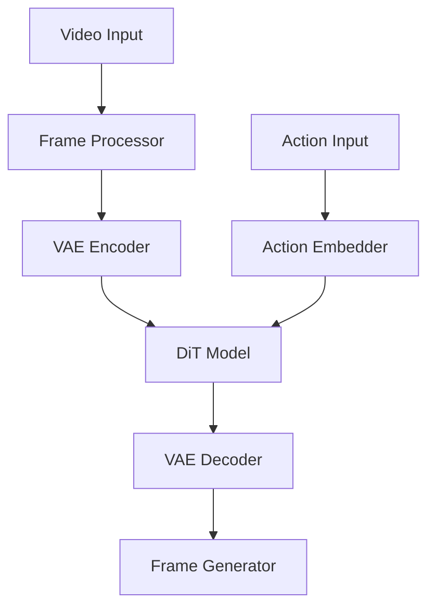
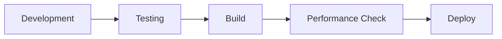

# Browser-Based Video Game Diffusion Model (BVGDM)


A cutting-edge implementation of client-side machine learning for real-time video game footage generation and transformation using TensorFlow.js.

## Overview

BVGDM brings server-class diffusion models directly to the browser, enabling real-time video game footage generation with minimal latency and no server dependencies.



### Key Features
- 🎮 Real-time video game footage generation
- 🚀 Fully client-side processing with WebGL acceleration
- 🔄 Browser-based training capabilities
- 🎯 Action-conditioned generation
- 🔒 Secure local processing
- 📱 Cross-browser compatibility

## System Requirements

| Component | Requirement |
|-----------|-------------|
| Browser | Chrome 90+, Firefox 88+, Safari 14+, Edge 90+ |
| GPU | WebGL 2.0 capable |
| Memory | 4GB+ RAM |
| Network | 10Mbps+ (initial model download) |

### Performance Targets
- Inference Speed: <50ms per frame
- Visual Quality: PSNR >30dB
- Memory Usage: <4GB RAM
- Training Time: <200ms per batch

## Quick Start

1. **Installation**
   ```bash
   npm install bvgdm
   ```

2. **Basic Usage**
   ```javascript
   import { BVGDM } from 'bvgdm';

   const model = new BVGDM({
     modelSize: 'large',
     accelerationMode: 'webgl'
   });

   // Load video and generate frames
   const video = await model.loadVideo('game.mp4');
   const generatedFrames = await model.generate(video, {
     actionSequence: actions,
     batchSize: 4
   });
   ```

3. **Configuration**
   ```javascript
   const config = {
     modelSize: 'large',      // large, medium, small
     precision: 'float32',    // float32, float16
     maxMemory: 4096,        // MB
     useWebGL: true,         // Enable GPU acceleration
     batchSize: 4            // Processing batch size
   };
   ```

## Development Setup

1. **Clone Repository**
   ```bash
   git clone https://github.com/username/bvgdm.git
   cd bvgdm
   ```

2. **Install Dependencies**
   ```bash
   npm install
   ```

3. **Start Development Server**
   ```bash
   npm run dev
   ```

4. **Run Tests**
   ```bash
   npm test
   ```

### Development Workflow



## Documentation

- [API Reference](./docs/API.md)
- [Architecture Guide](./docs/ARCHITECTURE.md)
- [Performance Tuning](./docs/PERFORMANCE.md)
- [Security Guidelines](./SECURITY.md)
- [Contribution Guide](./CONTRIBUTING.md)

## Performance Optimization

- Enable WebGL acceleration for optimal performance
- Adjust batch size based on available memory
- Use appropriate model size for your use case
- Monitor memory usage through browser dev tools
- Implement proper tensor cleanup

## Security Considerations

- All processing occurs client-side
- No data leaves the user's browser
- Model weights are verified via checksums
- Secure context required for WebGL acceleration
- See [SECURITY.md](./SECURITY.md) for details

## Browser Compatibility Matrix

| Feature | Chrome 90+ | Firefox 88+ | Safari 14+ | Edge 90+ |
|---------|------------|-------------|------------|-----------|
| WebGL 2.0 | ✅ | ✅ | ✅ | ✅ |
| WASM | ✅ | ✅ | ✅ | ✅ |
| IndexedDB | ✅ | ✅ | ✅ | ✅ |
| Web Workers | ✅ | ✅ | ✅ | ✅ |

## Contributing

We welcome contributions! Please see our [Contributing Guide](./CONTRIBUTING.md) for details.

## License

MIT License - see [LICENSE](./LICENSE) for details.

## Citation

```bibtex
@software{bvgdm2023,
  title = {Browser-Based Video Game Diffusion Model},
  year = {2023},
  author = {Project Contributors},
  url = {https://github.com/username/bvgdm}
}
```