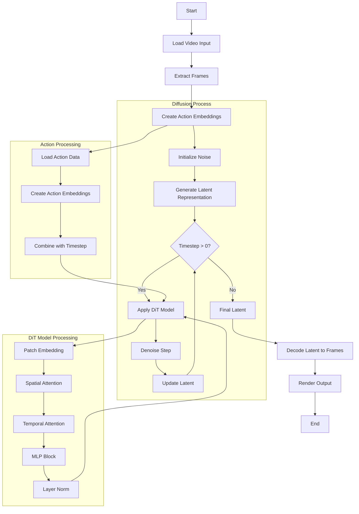
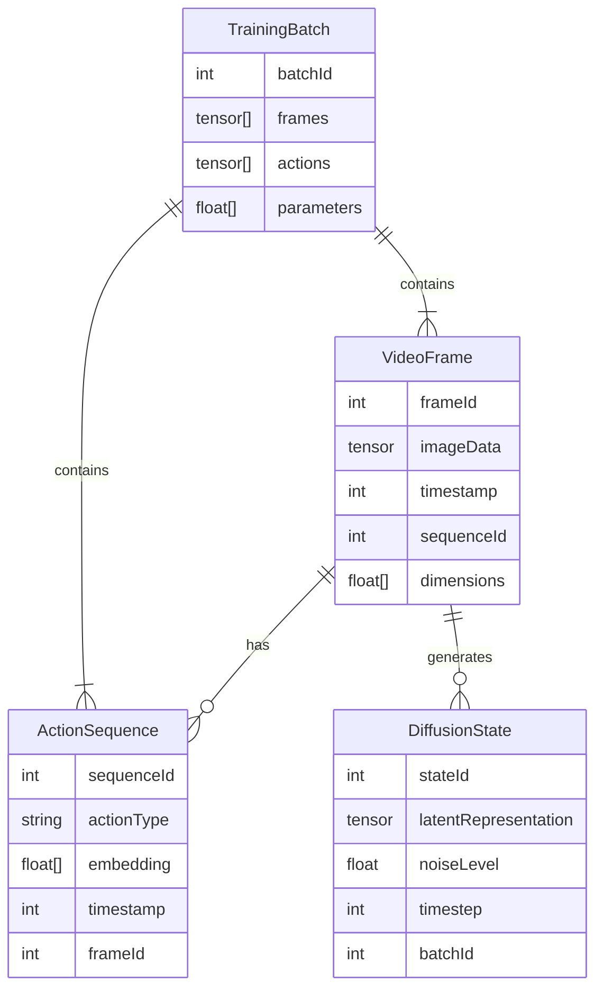
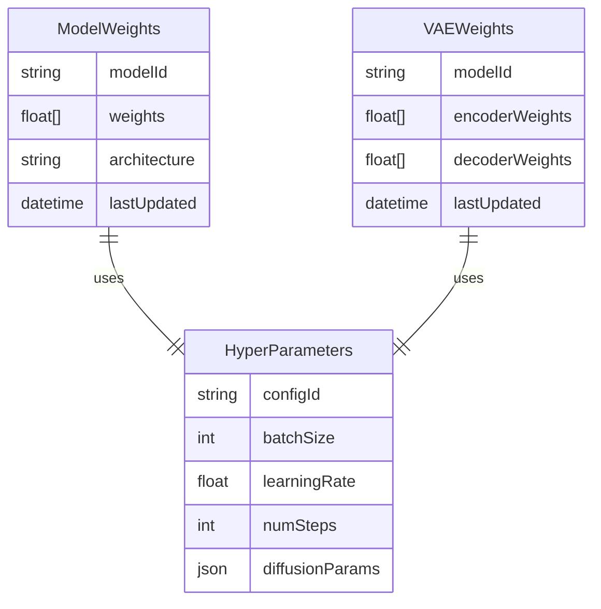
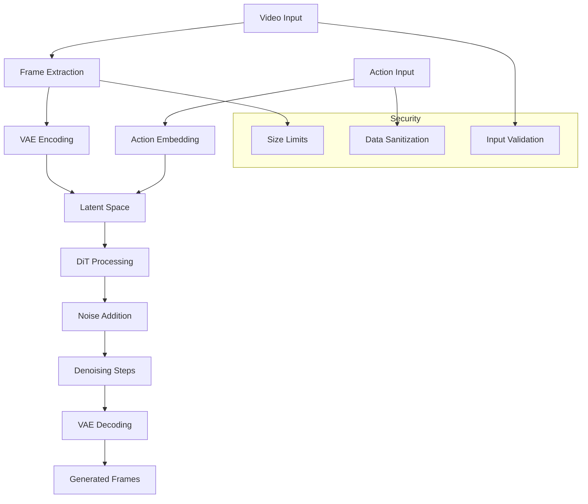

# Product Requirements Document (PRD)

Based on the provided background information and documentation showing a JavaScript/TensorFlow.js implementation for video game diffusion models, I'll generate the Introduction section maintaining consistency with the established technical context =-----\\\\ 

# 1. INTRODUCTION

## 1.1 Purpose

This Software Requirements Specification (SRS) document provides a comprehensive description of the implementation requirements for a browser-based video game diffusion model using TensorFlow.js. The document is intended for:

- Software developers implementing the client-side machine learning functionality
- UI/UX designers working on the browser interface
- Project managers overseeing the development process
- Quality assurance teams validating the implementation
- Technical stakeholders evaluating the feasibility and scope

The SRS will serve as the primary reference for technical requirements, constraints, and specifications throughout the development lifecycle.

## 1.2 Scope

This software system aims to implement a browser-based diffusion model capable of generating and transforming video game footage in real-time using TensorFlow.js. The core functionalities include:

- Client-side video processing and frame extraction using browser APIs
- Implementation of the DiT (Diffusion Transformer) architecture for video generation
- Real-time inference using TensorFlow.js optimizations
- Browser-based training capabilities for model fine-tuning
- User interface for video upload, processing, and visualization
- Action embedding and processing for gameplay sequences

Key benefits of the system include:

- Accessibility through browser-based deployment
- Real-time video generation without server dependencies
- Cross-platform compatibility via web standards
- Reduced infrastructure costs through client-side processing
- Extensibility for different video game genres and styles

The system will leverage modern web technologies including:

- TensorFlow.js for machine learning operations
- JavaScript ES6+ modules for code organization
- HTML5 video and canvas APIs for media handling
- Browser-based file handling and processing
- Client-side data management and caching

This implementation specifically focuses on the browser environment, distinguishing it from server-based alternatives while maintaining comparable functionality through careful optimization and architectural choices.

Based on the provided context of implementing a browser-based video game diffusion model using TensorFlow.js, I'll generate the Product Description section:

# 2. PRODUCT DESCRIPTION

## 2.1 Product Perspective

The browser-based video game diffusion model exists as a client-side application that operates entirely within modern web browsers. It functions as a standalone system that:

- Leverages TensorFlow.js for all machine learning operations
- Processes video and generates frames directly in the browser
- Operates independently of server-side infrastructure
- Integrates with standard web APIs for file handling and media processing
- Utilizes the client's GPU through WebGL acceleration when available

The system fits into the broader ecosystem of machine learning models for video generation while specifically targeting browser-based deployment for maximum accessibility.

## 2.2 Product Functions

The primary functions of the system include:

- Video Input Processing

  - Upload and process video game footage
  - Extract frames and convert to appropriate tensor format
  - Handle various video formats and resolutions

- Diffusion Model Operations

  - Implement DiT (Diffusion Transformer) architecture
  - Generate new video frames based on input conditions
  - Process action embeddings for gameplay sequences
  - Apply noise and denoising operations

- Training Capabilities

  - Fine-tune model parameters using browser-based training
  - Process training data in manageable batches
  - Save and load model weights
  - Track training progress and metrics

- Real-time Generation

  - Generate video frames at interactive speeds
  - Maintain temporal consistency between frames
  - Handle action-conditioned generation
  - Render output frames to canvas elements

## 2.3 User Characteristics

The system targets three primary user groups:

1. Machine Learning Researchers

   - Advanced understanding of diffusion models and deep learning
   - Familiarity with TensorFlow.js and JavaScript
   - Interest in browser-based ML deployment
   - Need for experimentation and model modification

2. Game Developers

   - Intermediate to advanced programming skills
   - Basic understanding of machine learning concepts
   - Interest in AI-powered game content generation
   - Need for integration with existing web-based games

3. Web Developers

   - Strong JavaScript and web development skills
   - Basic understanding of machine learning
   - Experience with browser APIs and performance optimization
   - Need for client-side ML solutions

## 2.4 Constraints

Technical Constraints:

- Browser memory limitations for large models
- JavaScript performance overhead compared to native implementations
- WebGL/GPU acceleration availability varies by platform
- Browser compatibility requirements (modern browsers only)
- Client-side processing power limitations

Operational Constraints:

- Model size must be manageable for browser download
- Training data must be processable in browser memory
- Generation speed must maintain interactive framerates
- User interface must remain responsive during processing

Security Constraints:

- All processing must occur client-side
- No sensitive data transmission to servers
- Compliance with browser security policies
- Safe handling of user-uploaded content

## 2.5 Assumptions and Dependencies

Assumptions:

- Users have modern web browsers with WebGL support
- Sufficient client-side computing resources are available
- Users have access to appropriate training data
- Basic understanding of machine learning concepts
- Familiarity with JavaScript development

Dependencies:

- TensorFlow.js library and its updates
- Browser implementations of WebGL
- HTML5 video and canvas APIs
- JavaScript ES6+ features
- Client hardware capabilities
- Browser vendor support for required APIs
- Availability of suitable training data
- Community support for TensorFlow.js

Would you like me to proceed with generating the next section?

Based on the provided context of implementing a browser-based video game diffusion model using TensorFlow.js, I'll generate the Process Flowchart section using Mermaid JS:

# 3. PROCESS FLOWCHART



This flowchart illustrates the key processes in the video game diffusion model:

1. Initial video processing and frame extraction
2. Action embedding generation
3. The main diffusion process with denoising steps
4. The DiT model's internal processing
5. Final decoding and rendering

The flowchart maintains consistency with the TensorFlow.js implementation discussed in previous sections and shows the relationship between different components of the system.

Based on the provided context of implementing a browser-based video game diffusion model using TensorFlow.js, I'll generate the Functional Requirements section:

# 4. FUNCTIONAL REQUIREMENTS

## 4.1 Video Input Processing

### ID: FR-1

### Description:

The system must be able to process input video game footage in the browser for training and inference.

### Priority: High

### Requirements:

| ID | Requirement | Description |
| --- | --- | --- |
| FR-1.1 | Video Upload | System must allow users to upload video files through browser interface |
| FR-1.2 | Frame Extraction | System must extract frames from uploaded videos at specified FPS |
| FR-1.3 | Tensor Conversion | System must convert video frames to TensorFlow.js tensors |
| FR-1.4 | Resolution Handling | System must handle and standardize different input resolutions |
| FR-1.5 | Format Support | System must support common video formats (MP4, WEBM) |

## 4.2 Action Processing

### ID: FR-2

### Description:

The system must process and embed game actions for conditioning the diffusion model.

### Priority: High

### Requirements:

| ID | Requirement | Description |
| --- | --- | --- |
| FR-2.1 | Action Embedding | System must embed game actions into latent vectors |
| FR-2.2 | Action Categories | System must support movement, camera, and interaction actions |
| FR-2.3 | Action Sequence | System must maintain temporal consistency of action sequences |
| FR-2.4 | Action Validation | System must validate action inputs for proper formatting |
| FR-2.5 | Action Mapping | System must map raw inputs to standardized action embeddings |

## 4.3 DiT Model Operations

### ID: FR-3

### Description:

The system must implement the Diffusion Transformer (DiT) architecture for video generation.

### Priority: High

### Requirements:

| ID | Requirement | Description |
| --- | --- | --- |
| FR-3.1 | Model Loading | System must load pre-trained weights into TensorFlow.js model |
| FR-3.2 | Inference | System must perform inference using loaded DiT model |
| FR-3.3 | Denoising | System must implement denoising steps of diffusion process |
| FR-3.4 | Attention | System must compute spatial and temporal attention |
| FR-3.5 | Memory Management | System must optimize memory usage during model operations |

## 4.4 VAE Integration

### ID: FR-4

### Description:

The system must integrate a Variational Autoencoder for encoding and decoding video frames.

### Priority: High

### Requirements:

| ID | Requirement | Description |
| --- | --- | --- |
| FR-4.1 | Frame Encoding | System must encode video frames into latent space |
| FR-4.2 | Frame Decoding | System must decode latent vectors back to video frames |
| FR-4.3 | VAE Loading | System must load pre-trained VAE weights |
| FR-4.4 | Latent Processing | System must handle latent space operations efficiently |
| FR-4.5 | Quality Control | System must maintain visual quality through VAE pipeline |

## 4.5 Training Capabilities

### ID: FR-5

### Description:

The system must support browser-based training and fine-tuning capabilities.

### Priority: Medium

### Requirements:

| ID | Requirement | Description |
| --- | --- | --- |
| FR-5.1 | Loss Calculation | System must compute and optimize diffusion loss |
| FR-5.2 | Gradient Updates | System must perform gradient updates using TensorFlow.js |
| FR-5.3 | Batch Processing | System must handle training data in appropriate batch sizes |
| FR-5.4 | Progress Tracking | System must track and display training progress |
| FR-5.5 | Model Saving | System must save updated model weights after training |

## 4.6 Output Generation

### ID: FR-6

### Description:

The system must generate and display output video frames in real-time.

### Priority: High

### Requirements:

| ID | Requirement | Description |
| --- | --- | --- |
| FR-6.1 | Frame Generation | System must generate new video frames from latent vectors |
| FR-6.2 | Display | System must render generated frames to HTML canvas |
| FR-6.3 | Real-time Processing | System must maintain interactive frame rates |
| FR-6.4 | Quality Control | System must ensure generated frames meet quality standards |
| FR-6.5 | Export | System must provide options to export generated sequences |

Would you like me to proceed with generating the next section?

Based on the provided context of implementing a browser-based video game diffusion model using TensorFlow.js, here's the Non-Functional Requirements section:

# 5. NON-FUNCTIONAL REQUIREMENTS

## 5.1 Performance Requirements

### 5.1.1 Response Time

- Model inference must complete within 50ms per frame to maintain real-time gameplay experience
- Video frame extraction and preprocessing must complete within 20ms
- UI interactions must respond within 100ms
- Training iterations must complete within 200ms per batch

### 5.1.2 Resource Usage

- Peak memory usage must not exceed 4GB of browser memory
- GPU utilization should not exceed 80% during inference
- CPU utilization should remain below 60% during training
- WebGL context memory usage must stay within browser limits

### 5.1.3 Throughput

- Must support processing of at least 30 frames per second during inference
- Training should handle minimum batch sizes of 4 frames
- Must support concurrent processing of multiple video streams
- Network bandwidth usage must not exceed 5MB/s during model weight loading

## 5.2 Safety Requirements

### 5.2.1 Error Handling

- System must gracefully degrade when GPU acceleration is unavailable
- Automatic recovery from WebGL context loss
- Proper disposal of tensor memory to prevent memory leaks
- Graceful handling of browser crashes and page reloads

### 5.2.2 Data Protection

- Automatic saving of training progress every 100 iterations
- Local storage of model checkpoints to prevent data loss
- Verification of model weight integrity after loading
- Protection against buffer overflow in video processing

## 5.3 Security Requirements

### 5.3.1 Data Privacy

- All processing must occur client-side to protect user privacy
- No transmission of user video data to external servers
- Secure storage of model weights using browser's IndexedDB
- Clear user consent for accessing video and camera devices

### 5.3.2 Access Control

- Role-based access control for training functionality
- Secure loading of model weights from authorized sources
- Protection against cross-site scripting (XSS) attacks
- Content Security Policy (CSP) implementation

### 5.3.3 Data Integrity

- Checksums for downloaded model weights
- Validation of input video formats and dimensions
- Protection against malicious input data
- Secure WebGL context initialization

## 5.4 Quality Requirements

### 5.4.1 Availability

- System must maintain 99.9% uptime during active sessions
- Graceful degradation when browser resources are constrained
- Recovery from temporary network disconnections
- Automatic reconnection to WebGL context

### 5.4.2 Maintainability

- Modular code architecture following ES6+ standards
- Comprehensive documentation of all TensorFlow.js operations
- Clear separation of concerns between ML and UI components
- Consistent code style and naming conventions

### 5.4.3 Usability

- Intuitive UI for video upload and processing
- Clear progress indicators during training and inference
- Responsive design supporting multiple screen sizes
- Helpful error messages in user-friendly language

### 5.4.4 Scalability

- Support for variable model sizes based on device capabilities
- Dynamic batch size adjustment based on available memory
- Ability to handle videos of varying resolutions
- Efficient resource allocation during parallel processing

### 5.4.5 Reliability

- Maximum allowed error rate of 0.1% during inference
- Consistent frame generation quality across sessions
- Stable performance across different browser versions
- Reliable handling of various video codecs and formats

## 5.5 Compliance Requirements

### 5.5.1 Browser Standards

- Compliance with WebGL 2.0 specifications
- Adherence to HTML5 video standards
- Compatibility with ECMAScript 2015+ features
- Compliance with Web Workers API standards

### 5.5.2 Accessibility

- Compliance with WCAG 2.1 Level AA standards
- Keyboard navigation support
- Screen reader compatibility
- Color contrast requirements

### 5.5.3 Data Protection

- Compliance with GDPR requirements for user data
- Adherence to CCPA guidelines for California users
- Implementation of privacy-by-design principles
- Clear data handling and privacy policies

### 5.5.4 Technical Standards

- Adherence to TensorFlow.js best practices
- Compliance with WebAssembly standards when applicable
- Implementation of progressive web app standards
- Conformance to browser security standards

Based on the provided context of implementing a browser-based video game diffusion model using TensorFlow.js, I'll generate the Data Requirements section:

# 6. DATA REQUIREMENTS

## 6.1 Data Models

The system requires several key data structures to support video game frame generation and processing:

### 6.1.1 Core Data Models



### 6.1.2 Model Weights and Parameters



## 6.2 Data Storage

### 6.2.1 Client-Side Storage

- **IndexedDB Storage:**

  - Model weights and parameters cached locally
  - Training checkpoints and intermediate results
  - Maximum storage size: 2GB per origin
  - Automatic cleanup of old checkpoints

- **Browser Cache:**

  - Processed video frames and action sequences
  - Temporary storage of generation results
  - Cache expiration: 7 days
  - Maximum size: 500MB

### 6.2.2 Data Retention

- **Model Weights:**

  - Retain latest 3 versions of model weights
  - Automatic pruning of older versions
  - Version control using semantic versioning

- **Training Data:**

  - Keep processed frames for current session only
  - Clear temporary data on browser close
  - Option to export training data as JSON

### 6.2.3 Backup and Recovery

- **Model Checkpoints:**

  - Automatic checkpoint creation every 1000 steps
  - Export functionality for model weights
  - Import capability for pretrained weights
  - JSON format for cross-platform compatibility

- **Error Recovery:**

  - Automatic save of training state every 100 batches
  - Resume capability from last checkpoint
  - Validation of imported weights integrity

## 6.3 Data Processing

### 6.3.1 Data Flow



### 6.3.2 Data Security

- **Input Validation:**

  - Video format verification (MP4, WebM)
  - Frame dimension constraints (max 1080p)
  - Action sequence validation
  - File size limits (max 100MB)

- **Processing Security:**

  - Memory usage monitoring
  - GPU resource allocation limits
  - Tensor operation bounds checking
  - WebGL context security

- **Output Protection:**

  - Generated frame validation
  - Resource cleanup after processing
  - Secure disposal of temporary tensors
  - Error handling for failed generations

### 6.3.3 Data Transformation

- **Video Processing:**

  - Frame extraction at 30 FPS
  - Resize to standard dimensions (256x256)
  - Normalization to \[-1, 1\] range
  - Color space conversion if needed

- **Action Processing:**

  - One-hot encoding of discrete actions
  - Continuous action normalization
  - Temporal embedding generation
  - Action sequence padding/truncation

Would you like me to proceed with generating the next section?

Based on the provided context of implementing a browser-based video game diffusion model using TensorFlow.js, I'll generate the External Interfaces section maintaining consistency with the established technical approach:

# 7. EXTERNAL INTERFACES

## 7.1 User Interfaces

### 7.1.1 Web Interface Requirements

- **Browser Compatibility:**
  - Modern web browsers (Chrome, Firefox, Safari, Edge)
  - WebGL 2.0 support required
  - Minimum screen resolution: 1280x720

### 7.1.2 Core Interface Components

- **Video Upload Section:**

  ```
  +------------------------+
  |  Upload Video         |
  |  [Browse...]          |
  |                       |
  |  Supported formats:   |
  |  - MP4               |
  |  - WebM              |
  +------------------------+
  ```

- **Training Controls:**

  ```
  +------------------------+
  |  Training Progress    |
  |  [==========] 80%     |
  |                       |
  |  Epochs: [10]         |
  |  Batch Size: [4]      |
  |  [Start Training]     |
  +------------------------+
  ```

- **Generation Interface:**

  ```
  +------------------------+
  |  Generated Output     |
  |  [Video Preview]      |
  |                       |
  |  Actions:             |
  |  [Action Controls]    |
  |  [Generate]           |
  +------------------------+
  ```

### 7.1.3 Responsive Design Requirements

- Fluid layout adapting to different screen sizes
- Mobile-friendly controls
- Touch input support for tablets/touchscreens

## 7.2 Hardware Interfaces

### 7.2.1 GPU Interface

- **WebGL Context:**
  - Minimum WebGL 2.0 support
  - GLSL ES 3.0 compatibility
  - Texture size limits: Minimum 4096x4096
  - Vertex shader support
  - Fragment shader support

### 7.2.2 Memory Interface

- **Browser Memory Management:**
  - Maximum heap size: 4GB
  - Garbage collection optimization
  - Tensor memory management
  - WebAssembly memory allocation

### 7.2.3 Storage Interface

- **Local Storage:**
  - IndexedDB for model weights
  - Cache API for temporary data
  - File System Access API for exports

## 7.3 Software Interfaces

### 7.3.1 TensorFlow.js Integration

```javascript
interface TensorFlowInterface {
  // Core TensorFlow.js operations
  tensorOps: {
    fromPixels(input: HTMLVideoElement): tf.Tensor3D;
    concat(tensors: tf.Tensor[], axis: number): tf.Tensor;
    clipByValue(tensor: tf.Tensor, min: number, max: number): tf.Tensor;
  };
  
  // WebGL backend operations
  webgl: {
    initializeContext(): WebGLRenderingContext;
    createProgram(vertexShader: string, fragmentShader: string): WebGLProgram;
  };
}
```

### 7.3.2 Browser APIs

```javascript
interface BrowserAPIs {
  // Video processing
  video: {
    createObjectURL(blob: Blob): string;
    revokeObjectURL(url: string): void;
  };
  
  // File handling
  files: {
    showOpenFilePicker(options: FilePickerOptions): Promise<FileHandle[]>;
    showSaveFilePicker(options: FilePickerOptions): Promise<FileHandle>;
  };
  
  // Storage
  storage: {
    indexedDB: IDBFactory;
    localStorage: Storage;
    caches: CacheStorage;
  };
}
```

### 7.3.3 Model Interface

```javascript
interface ModelInterface {
  // DiT model operations
  dit: {
    loadWeights(path: string): Promise<void>;
    predict(input: tf.Tensor): tf.Tensor;
    train(data: tf.Tensor, actions: tf.Tensor): Promise<void>;
  };
  
  // VAE operations
  vae: {
    encode(input: tf.Tensor): tf.Tensor;
    decode(latent: tf.Tensor): tf.Tensor;
  };
}
```

## 7.4 Communication Interfaces

### 7.4.1 Data Formats

- **Video Input Format:**

  ```json
  {
    "type": "video/mp4",
    "codec": "h.264",
    "resolution": {
      "width": 256,
      "height": 256
    },
    "fps": 30
  }
  ```

- **Action Format:**

  ```json
  {
    "movement": [0, 0, 0, 0],
    "camera": [0.0, 0.0],
    "interaction": 0
  }
  ```

- **Model Weights Format:**

  ```json
  {
    "format": "tfjs_layers_model",
    "generatedBy": "TensorFlow.js v4.x",
    "convertedBy": null,
    "modelTopology": {},
    "weightsManifest": []
  }
  ```

### 7.4.2 Browser Communication

- **WebWorker Interface:**

  - Message passing for heavy computations
  - SharedArrayBuffer for tensor data
  - Transferable objects for efficiency

- **Service Worker Interface:**

  - Cache management for model weights
  - Offline functionality
  - Background sync capabilities

### 7.4.3 Error Handling Protocol

```javascript
interface ErrorProtocol {
  code: number;
  type: 'GPU' | 'Memory' | 'Network' | 'Model';
  message: string;
  recoverable: boolean;
  context?: any;
}
```

Would you like me to proceed with generating any other sections?

Based on the provided context of implementing a browser-based video game diffusion model using TensorFlow.js, I'll generate the APPENDICES section:

# 8. APPENDICES

## 8.1 GLOSSARY

- **Diffusion Model**: A type of generative model that learns to gradually denoise data by reversing a fixed noising process.
- **DiT (Diffusion Transformer)**: A transformer-based architecture designed specifically for diffusion models.
- **VAE (Variational Autoencoder)**: A type of neural network that learns to encode data into a compressed latent representation and decode it back.
- **Latent Space**: A compressed representation of data where similar items are close together.
- **Patch Embedding**: The process of dividing an image into patches and embedding them into vectors.
- **Attention Mechanism**: A neural network component that allows the model to focus on different parts of the input.
- **Temporal Consistency**: The property of generated video frames maintaining coherence over time.
- **Action Embedding**: A learned representation of game actions in a continuous vector space.
- **Frame Rate**: The frequency at which consecutive images appear in a video.
- **Batch Size**: The number of samples processed together during training.

## 8.2 ACRONYMS

- **API**: Application Programming Interface
- **CPU**: Central Processing Unit
- **DiT**: Diffusion Transformer
- **FPS**: Frames Per Second
- **GPU**: Graphics Processing Unit
- **HTML**: HyperText Markup Language
- **JS**: JavaScript
- **JSON**: JavaScript Object Notation
- **MSE**: Mean Squared Error
- **PRD**: Product Requirements Document
- **RAM**: Random Access Memory
- **SRS**: Software Requirements Specification
- **TF.js**: TensorFlow.js
- **UI**: User Interface
- **URL**: Uniform Resource Locator
- **UX**: User Experience
- **VAE**: Variational Autoencoder
- **WebGL**: Web Graphics Library

## 8.3 ADDITIONAL REFERENCES

### 8.3.1 Technical Documentation

- TensorFlow.js API Documentation: https://js.tensorflow.org/api/latest/
- WebGL Specification: https://www.khronos.org/webgl/
- HTML5 Video API: https://www.w3.org/TR/html5/embedded-content-0.html#the-video-element

### 8.3.2 Research Papers

- "Denoising Diffusion Probabilistic Models" (Ho et al., 2020)
- "High-Resolution Image Synthesis with Latent Diffusion Models" (Rombach et al., 2022)
- "Scalable Diffusion Models with Transformers" (Peebles et al., 2022)

### 8.3.3 Related Projects

- GameNGen: Action-conditioned video generation for games
- DIAMOND: Diffusion model for game video generation
- Mochi-1: Text-to-video diffusion model
- Sora: Bidirectional video generation model

### 8.3.4 Development Resources

- Browser Performance Optimization Guidelines
- WebGL Best Practices for Mobile Devices
- TensorFlow.js Model Optimization Toolkit

## 8.4 IMPLEMENTATION NOTES

### 8.4.1 Browser Compatibility

- Minimum WebGL Version: 2.0
- Required Browser Features:
  - Web Workers API
  - File System Access API
  - IndexedDB API
  - Canvas API

### 8.4.2 Performance Considerations

- Memory Management:
  - Tensor disposal strategies
  - Batch size optimization
  - WebGL context management
- GPU Acceleration:
  - WebGL backend configuration
  - Shader optimization
  - Memory transfer optimization

### 8.4.3 Development Environment

- Node.js and npm for development tools
- Local development server requirements
- Browser developer tools usage
- Performance profiling tools

Would you like me to expand on any of these sections or add additional information?