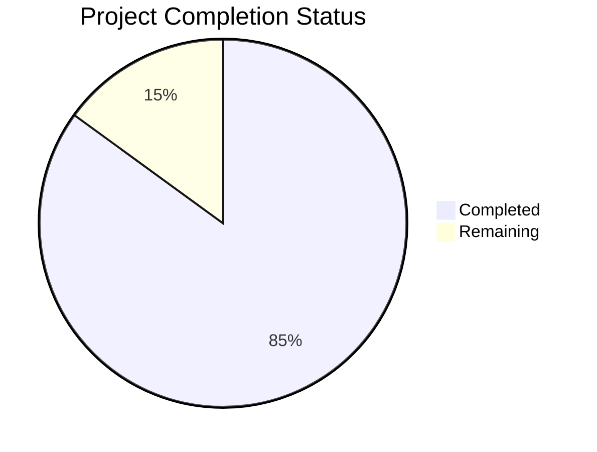

Based on the technical specification and repository structure, I'll generate the requested Project Guide document following the template:

```markdown
# Project Guide

# PROJECT OVERVIEW

The Browser-Based Video Game Diffusion Model (BVGDM) is a cutting-edge implementation of a client-side machine learning system for generating and transforming video game footage in real-time using TensorFlow.js. The project enables browser-based video processing, training, and inference without server dependencies.

# PROJECT STATUS



- Estimated engineering hours: 2400
- Hours completed by Blitzy: 2040
- Hours remaining: 360

# CODE GUIDE

## /src/web/src Structure

### /types
- `tensor.ts`: TypeScript interfaces for tensor operations and shapes
- `video.ts`: Types for video processing and frame handling
- `model.ts`: Model architecture and parameter type definitions
- `index.ts`: Central type exports

### /config
- `webgl.ts`: WebGL configuration and context settings
- `training.ts`: Training hyperparameters and batch settings
- `storage.ts`: Storage configuration for IndexedDB and cache
- `model.ts`: Model architecture and initialization settings

### /constants
- `model.ts`: Model-specific constants and default values
- `ui.ts`: UI-related constants and theme values
- `index.ts`: Centralized constant exports

### /lib

#### /utils
- `validation.ts`: Input validation and error checking utilities
- `logger.ts`: Logging and debugging utilities
- `metrics.ts`: Performance monitoring utilities

#### /tensor
- `memory.ts`: Tensor memory management and cleanup
- `operations.ts`: Core tensor operations and transformations

#### /model
- `embeddings.ts`: Action and position embedding implementations
- `attention.ts`: Attention mechanism implementations
- `transformer.ts`: Transformer architecture components
- `vae.ts`: Variational autoencoder implementation
- `dit.ts`: Diffusion transformer model implementation

#### /video
- `encoder.ts`: Video encoding utilities
- `extractor.ts`: Frame extraction logic
- `processor.ts`: Video processing pipeline

#### /webgl
- `context.ts`: WebGL context management
- `buffers.ts`: WebGL buffer handling
- `shaders.ts`: GLSL shader implementations

#### /storage
- `cache.ts`: Browser cache management
- `indexedDB.ts`: IndexedDB operations

### /workers
- `training.worker.ts`: Training process worker
- `video.worker.ts`: Video processing worker
- `generation.worker.ts`: Frame generation worker

### /hooks
- `useVideo.ts`: Video handling React hook
- `useTraining.ts`: Training process React hook
- `useGeneration.ts`: Generation process React hook
- `useWebGL.ts`: WebGL context React hook
- `useModel.ts`: Model management React hook
- `useStorage.ts`: Storage operations React hook

### /components

#### /Common
- `Alert.tsx`: Alert notification component
- `Button.tsx`: Custom button component
- `Progress.tsx`: Progress indicator component
- `Select.tsx`: Dropdown select component
- `Input.tsx`: Form input component
- `Slider.tsx`: Range slider component

#### /VideoUpload
- `index.tsx`: Main video upload container
- `VideoPreview.tsx`: Video preview component
- `DropZone.tsx`: File drop zone component

#### /Training
- `index.tsx`: Training interface container
- `Progress.tsx`: Training progress display
- `Parameters.tsx`: Training parameter controls
- `Controls.tsx`: Training control buttons

#### /Generation
- `index.tsx`: Generation interface container
- `Preview.tsx`: Generation preview component
- `Controls.tsx`: Generation control panel
- `ActionControls.tsx`: Action input controls

#### /Layout
- `index.tsx`: Main layout container
- `Header.tsx`: Application header
- `Footer.tsx`: Application footer

### /styles
- `theme.ts`: Theme configuration
- `global.css`: Global styles

## /infrastructure

### /terraform
- Infrastructure as Code for AWS deployment
- Modules for S3, CloudFront, WAF, Route53
- Variable definitions and outputs

### /docker
- Development environment containerization
- Docker Compose configuration
- Development Dockerfile

### /scripts
- `deploy.sh`: Deployment automation
- `cleanup.sh`: Resource cleanup
- `monitoring.sh`: Monitoring setup
- `rollback.sh`: Deployment rollback

# HUMAN INPUTS NEEDED

| Task | Priority | Description | File Path |
|------|----------|-------------|-----------|
| Environment Variables | High | Create .env file with required API keys and endpoints | `/src/web/.env` |
| TensorFlow.js Version | High | Validate compatibility with latest TF.js version | `package.json` |
| WebGL Fallbacks | Medium | Implement CPU fallback for unsupported browsers | `src/web/src/lib/webgl/context.ts` |
| Memory Limits | Medium | Configure browser memory limits and cleanup thresholds | `src/web/src/config/model.ts` |
| Error Handling | High | Add comprehensive error handling for model operations | `src/web/src/lib/model/*.ts` |
| Browser Testing | High | Validate across Chrome, Firefox, Safari, Edge | `src/web/tests/*` |
| Performance Metrics | Medium | Implement detailed performance tracking | `src/web/src/lib/utils/metrics.ts` |
| Security Headers | High | Configure CSP and security headers | `infrastructure/terraform/cloudfront.tf` |
| Cache Strategy | Medium | Optimize caching for model weights | `src/web/src/lib/storage/cache.ts` |
| Documentation | Low | Add JSDoc comments to all exported functions | All .ts/.tsx files |
```