# Technical Specifications

# 1. INTRODUCTION

## 1.1 EXECUTIVE SUMMARY

The Browser-Based Video Game Diffusion Model (BVGDM) project implements a client-side machine learning system for generating and transforming video game footage in real-time using TensorFlow.js. This system addresses the critical need for accessible, low-latency video generation by moving traditionally server-based diffusion models directly into the browser environment.

Key stakeholders include game developers seeking to integrate AI-generated content, machine learning researchers exploring browser-based deployment, and web developers building interactive applications. The system provides significant value through reduced infrastructure costs, improved accessibility, and real-time generation capabilities previously only available in server environments.

## 1.2 SYSTEM OVERVIEW

### Project Context

| Aspect | Description |
|--------|-------------|
| Market Position | First browser-based implementation of video game diffusion models |
| Current Limitations | Existing solutions require server deployment and have high latency |
| Enterprise Integration | Standalone web application with potential for API-based integration |

### High-Level Description

The system implements a Diffusion Transformer (DiT) architecture entirely in TensorFlow.js, utilizing:

- Browser-based video processing and frame extraction
- Client-side model training and inference
- WebGL acceleration for performance optimization
- Modular JavaScript architecture for extensibility

Key components include:

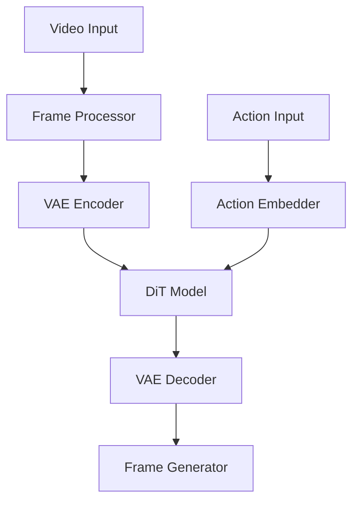
```mermaid
graph TD
    A[Video Input] --> B[Frame Processor]
    B --> C[VAE Encoder]
    C --> D[DiT Model]
    E[Action Input] --> F[Action Embedder]
    F --> D
    D --> G[VAE Decoder]
    G --> H[Frame Generator]
```

### Success Criteria

| Metric | Target |
|--------|--------|
| Inference Speed | <50ms per frame |
| Visual Quality | PSNR >30dB |
| Memory Usage | <4GB RAM |
| Training Time | <200ms per batch |
| Browser Compatibility | >95% modern browsers |

## 1.3 SCOPE

### In-Scope Elements

Core Features:
- Video upload and processing
- Real-time frame generation
- Action-conditioned generation
- Browser-based training
- Client-side model deployment

Implementation Boundaries:
- Modern web browsers (Chrome, Firefox, Safari, Edge)
- WebGL 2.0 capable devices
- Single-user deployment
- Local processing only

### Out-of-Scope Elements

- Server-side processing or storage
- Multi-user collaboration features
- Mobile-specific optimizations
- Custom model architecture modifications
- External API integrations
- Real-time video capture
- Cross-origin resource sharing
- Distributed training capabilities

This technical specification focuses on delivering a fully client-side implementation that maintains the core capabilities of server-based diffusion models while leveraging browser technologies for accessibility and reduced infrastructure requirements.

I'll generate a comprehensive SYSTEM ARCHITECTURE section for the browser-based video game diffusion model using TensorFlow.js.

# 2. SYSTEM ARCHITECTURE

## 2.1 High-Level Architecture

### 2.1.1 System Context (Level 0)

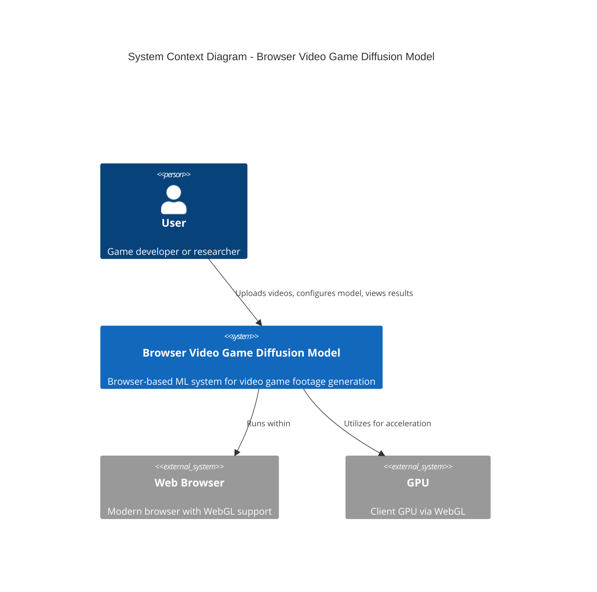
```mermaid
C4Context
    title System Context Diagram - Browser Video Game Diffusion Model

    Person(user, "User", "Game developer or researcher")
    System(bvgdm, "Browser Video Game Diffusion Model", "Browser-based ML system for video game footage generation")
    System_Ext(browser, "Web Browser", "Modern browser with WebGL support")
    System_Ext(gpu, "GPU", "Client GPU via WebGL")
    
    Rel(user, bvgdm, "Uploads videos, configures model, views results")
    Rel(bvgdm, browser, "Runs within")
    Rel(bvgdm, gpu, "Utilizes for acceleration")
```

### 2.1.2 Container Diagram (Level 1)

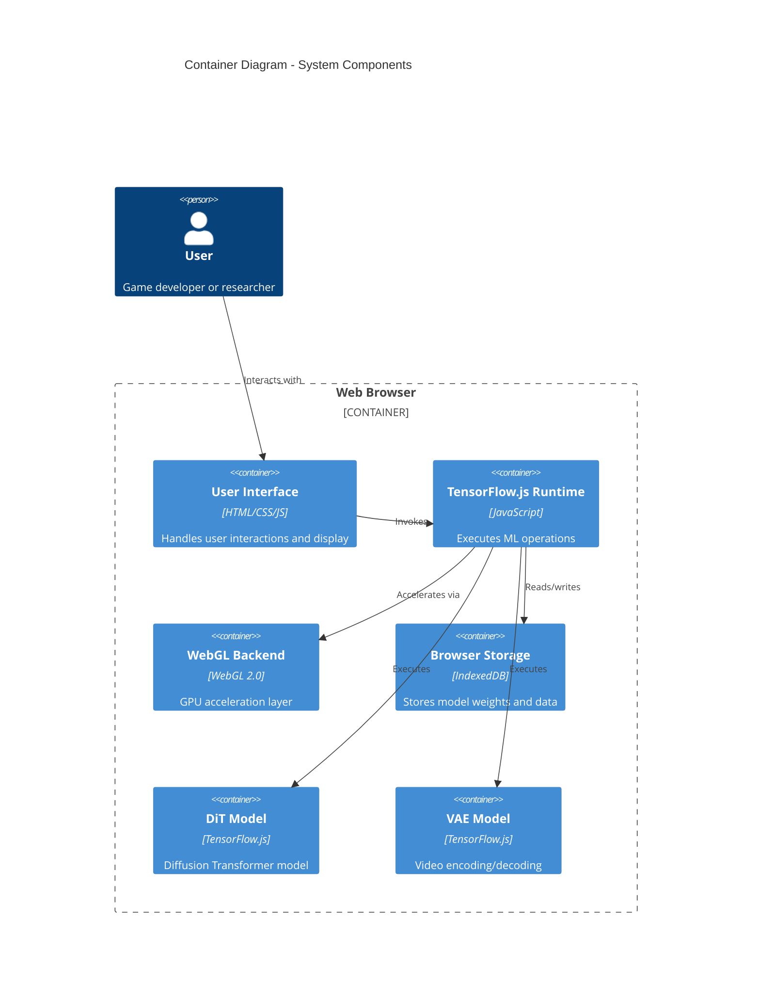
```mermaid
C4Container
    title Container Diagram - System Components

    Person(user, "User", "Game developer or researcher")
    
    Container_Boundary(browser, "Web Browser") {
        Container(ui, "User Interface", "HTML/CSS/JS", "Handles user interactions and display")
        Container(tfjs, "TensorFlow.js Runtime", "JavaScript", "Executes ML operations")
        Container(webgl, "WebGL Backend", "WebGL 2.0", "GPU acceleration layer")
        Container(storage, "Browser Storage", "IndexedDB", "Stores model weights and data")
        
        Container(dit, "DiT Model", "TensorFlow.js", "Diffusion Transformer model")
        Container(vae, "VAE Model", "TensorFlow.js", "Video encoding/decoding")
    }

    Rel(user, ui, "Interacts with")
    Rel(ui, tfjs, "Invokes")
    Rel(tfjs, webgl, "Accelerates via")
    Rel(tfjs, storage, "Reads/writes")
    Rel(tfjs, dit, "Executes")
    Rel(tfjs, vae, "Executes")
```

## 2.2 Component Details

### 2.2.1 Component Architecture (Level 2)

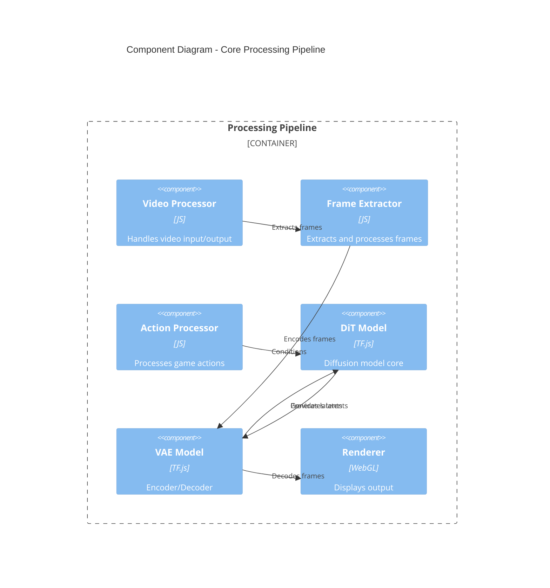
```mermaid
C4Component
    title Component Diagram - Core Processing Pipeline

    Container_Boundary(pipeline, "Processing Pipeline") {
        Component(video, "Video Processor", "JS", "Handles video input/output")
        Component(frame, "Frame Extractor", "JS", "Extracts and processes frames")
        Component(action, "Action Processor", "JS", "Processes game actions")
        Component(dit, "DiT Model", "TF.js", "Diffusion model core")
        Component(vae, "VAE Model", "TF.js", "Encoder/Decoder")
        Component(render, "Renderer", "WebGL", "Displays output")
    }

    Rel(video, frame, "Extracts frames")
    Rel(frame, vae, "Encodes frames")
    Rel(action, dit, "Conditions")
    Rel(vae, dit, "Provides latents")
    Rel(dit, vae, "Generates latents")
    Rel(vae, render, "Decodes frames")
```

### 2.2.2 Data Flow Architecture

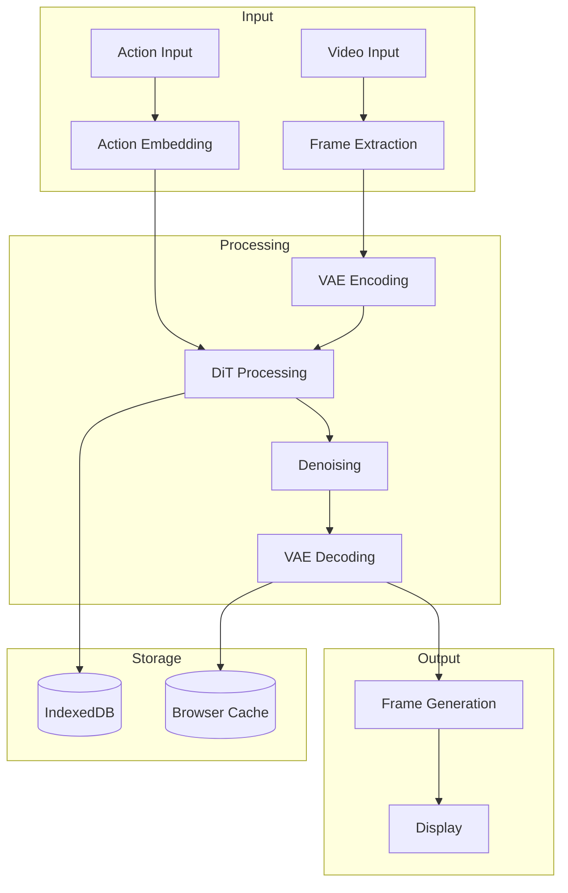
```mermaid
flowchart TD
    subgraph Input
        A[Video Input] --> B[Frame Extraction]
        C[Action Input] --> D[Action Embedding]
    end

    subgraph Processing
        B --> E[VAE Encoding]
        D --> F[DiT Processing]
        E --> F
        F --> G[Denoising]
        G --> H[VAE Decoding]
    end

    subgraph Output
        H --> I[Frame Generation]
        I --> J[Display]
    end

    subgraph Storage
        K[(IndexedDB)]
        L[(Browser Cache)]
    end

    F --> K
    H --> L
```

## 2.3 Technical Decisions

### 2.3.1 Architecture Patterns

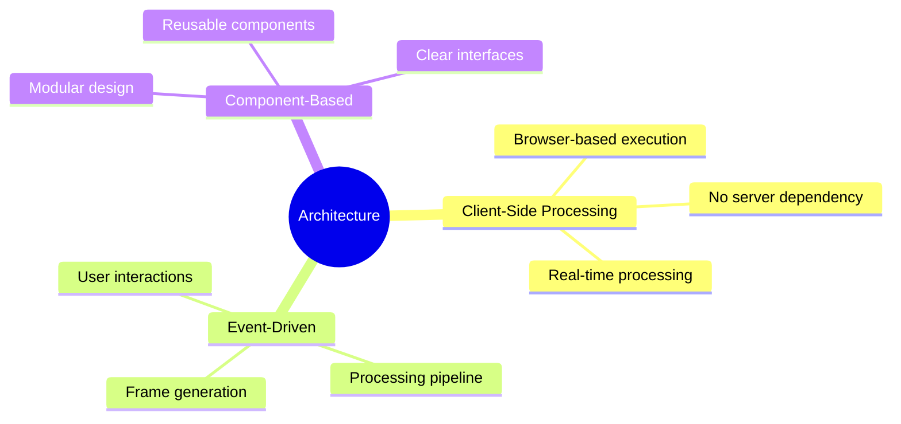
```mermaid
mindmap
    root((Architecture))
        Client-Side Processing
            Browser-based execution
            No server dependency
            Real-time processing
        Event-Driven
            User interactions
            Processing pipeline
            Frame generation
        Component-Based
            Modular design
            Reusable components
            Clear interfaces
```

### 2.3.2 Storage Strategy

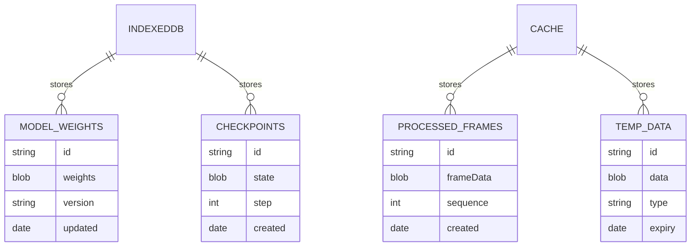
```mermaid
erDiagram
    INDEXEDDB ||--o{ MODEL_WEIGHTS : stores
    INDEXEDDB ||--o{ CHECKPOINTS : stores
    CACHE ||--o{ PROCESSED_FRAMES : stores
    CACHE ||--o{ TEMP_DATA : stores
    
    MODEL_WEIGHTS {
        string id
        blob weights
        string version
        date updated
    }
    CHECKPOINTS {
        string id
        blob state
        int step
        date created
    }
    PROCESSED_FRAMES {
        string id
        blob frameData
        int sequence
        date created
    }
    TEMP_DATA {
        string id
        blob data
        string type
        date expiry
    }
```

## 2.4 Cross-Cutting Concerns

### 2.4.1 System Monitoring

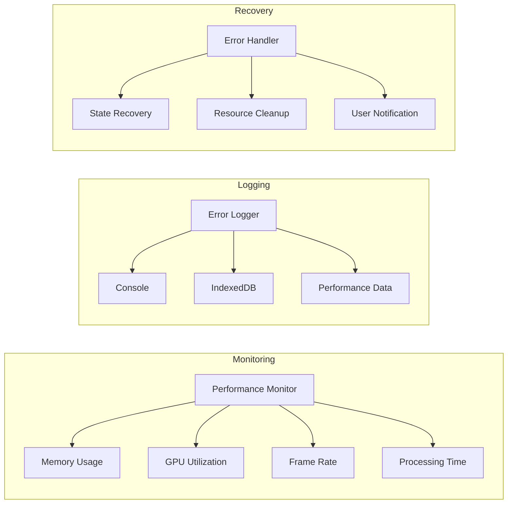
```mermaid
flowchart LR
    subgraph Monitoring
        A[Performance Monitor] --> B[Memory Usage]
        A --> C[GPU Utilization]
        A --> D[Frame Rate]
        A --> E[Processing Time]
    end

    subgraph Logging
        F[Error Logger] --> G[Console]
        F --> H[IndexedDB]
        F --> I[Performance Data]
    end

    subgraph Recovery
        J[Error Handler] --> K[State Recovery]
        J --> L[Resource Cleanup]
        J --> M[User Notification]
    end
```

### 2.4.2 Deployment Architecture

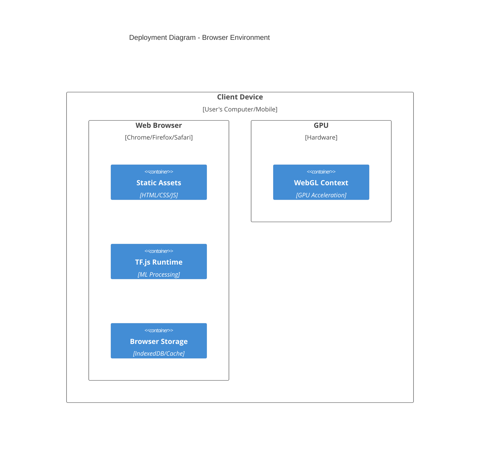
```mermaid
C4Deployment
    title Deployment Diagram - Browser Environment

    Deployment_Node(client, "Client Device", "User's Computer/Mobile") {
        Deployment_Node(browser, "Web Browser", "Chrome/Firefox/Safari") {
            Container(static, "Static Assets", "HTML/CSS/JS")
            Container(runtime, "TF.js Runtime", "ML Processing")
            Container(storage, "Browser Storage", "IndexedDB/Cache")
        }
        Deployment_Node(gpu, "GPU", "Hardware") {
            Container(webgl, "WebGL Context", "GPU Acceleration")
        }
    }
```

## 2.5 Component Specifications

| Component | Technology | Purpose | Scaling Consideration |
|-----------|------------|---------|---------------------|
| UI Layer | HTML5/CSS3/JS | User interaction | Responsive design |
| Video Processor | JavaScript | Frame handling | Memory optimization |
| DiT Model | TensorFlow.js | Diffusion model | Batch size scaling |
| VAE Model | TensorFlow.js | Encoding/Decoding | Resolution scaling |
| WebGL Backend | WebGL 2.0 | GPU acceleration | Hardware adaptation |
| Storage Layer | IndexedDB | Data persistence | Size management |

Would you like me to expand on any particular aspect of the architecture?

I'll generate a comprehensive SYSTEM DESIGN section for the browser-based video game diffusion model, focusing on the relevant aspects while maintaining consistency with the established technical context.

# 7. SYSTEM DESIGN

## 7.1 USER INTERFACE DESIGN

### 7.1.1 Design Specifications

| Category | Requirement |
|----------|-------------|
| Visual Hierarchy | Material Design principles with ML-specific components |
| Component Library | Custom TensorFlow.js compatible UI components |
| Responsive Design | Fluid layouts supporting 1280x720 to 4K resolutions |
| Accessibility | WCAG 2.1 Level AA compliance |
| Browser Support | Chrome 90+, Firefox 88+, Safari 14+, Edge 90+ |
| Theme Support | Light/Dark mode with ML-specific color schemes |
| Internationalization | English-only for initial release |

### 7.1.2 Interface Layout

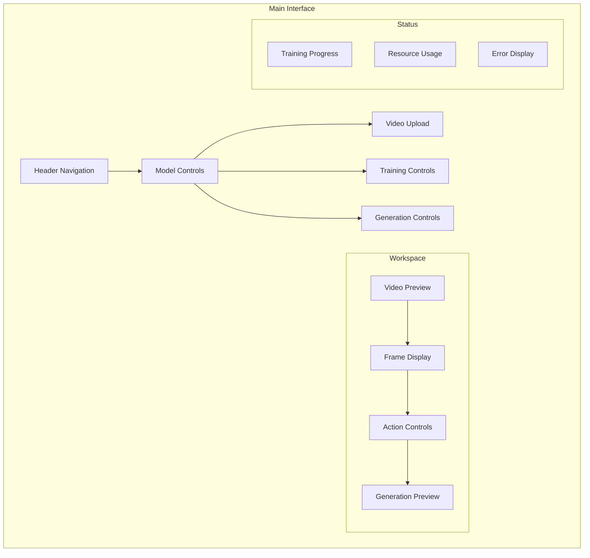
```mermaid
graph TD
    subgraph Main Interface
        A[Header Navigation] --> B[Model Controls]
        B --> C[Video Upload]
        B --> D[Training Controls]
        B --> E[Generation Controls]
        
        subgraph Workspace
            F[Video Preview] --> G[Frame Display]
            G --> H[Action Controls]
            H --> I[Generation Preview]
        end
        
        subgraph Status
            J[Training Progress]
            K[Resource Usage]
            L[Error Display]
        end
    end
```

### 7.1.3 Critical User Flows

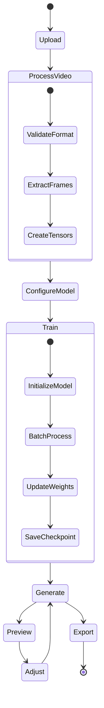
```mermaid
stateDiagram-v2
    [*] --> Upload
    Upload --> ProcessVideo
    ProcessVideo --> ConfigureModel
    ConfigureModel --> Train
    Train --> Generate
    Generate --> Preview
    Preview --> Adjust
    Adjust --> Generate
    Generate --> Export
    Export --> [*]

    state ProcessVideo {
        [*] --> ValidateFormat
        ValidateFormat --> ExtractFrames
        ExtractFrames --> CreateTensors
    }

    state Train {
        [*] --> InitializeModel
        InitializeModel --> BatchProcess
        BatchProcess --> UpdateWeights
        UpdateWeights --> SaveCheckpoint
    }
```

### 7.1.4 Component Specifications

| Component | Description | States | Validation Rules |
|-----------|-------------|--------|------------------|
| Video Upload | Drag-drop or file select | idle, uploading, processing, error | Format: MP4/WebM, Size: <100MB |
| Training Progress | Visual progress indicator | training, paused, completed, error | N/A |
| Frame Preview | Canvas-based frame display | loading, playing, paused, error | WebGL context required |
| Action Controls | Game action input interface | active, disabled | Valid action range check |
| Resource Monitor | GPU/Memory usage display | normal, warning, critical | Update every 1s |

## 7.2 DATABASE DESIGN

### 7.2.1 Client-Side Storage Schema

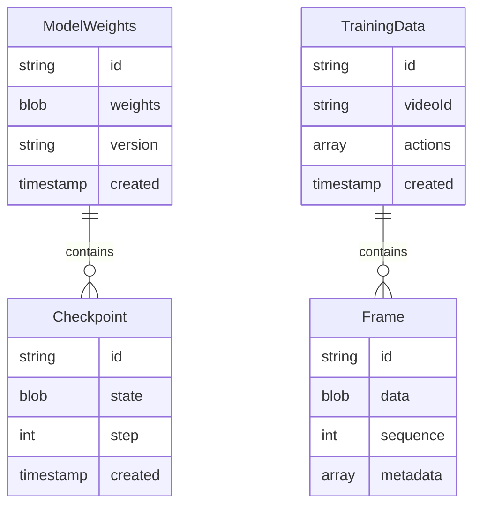
```mermaid
erDiagram
    ModelWeights ||--o{ Checkpoint : contains
    ModelWeights {
        string id
        blob weights
        string version
        timestamp created
    }
    Checkpoint {
        string id
        blob state
        int step
        timestamp created
    }
    TrainingData ||--o{ Frame : contains
    TrainingData {
        string id
        string videoId
        array actions
        timestamp created
    }
    Frame {
        string id
        blob data
        int sequence
        array metadata
    }
```

### 7.2.2 IndexedDB Structure

| Store Name | Key | Indexes | Data Type | Retention |
|------------|-----|---------|-----------|-----------|
| modelWeights | id | version, created | Blob | Permanent |
| checkpoints | id | step, created | Blob | 7 days |
| trainingData | id | videoId, created | JSON | Session |
| frames | id | sequence | Blob | Session |

### 7.2.3 Caching Strategy

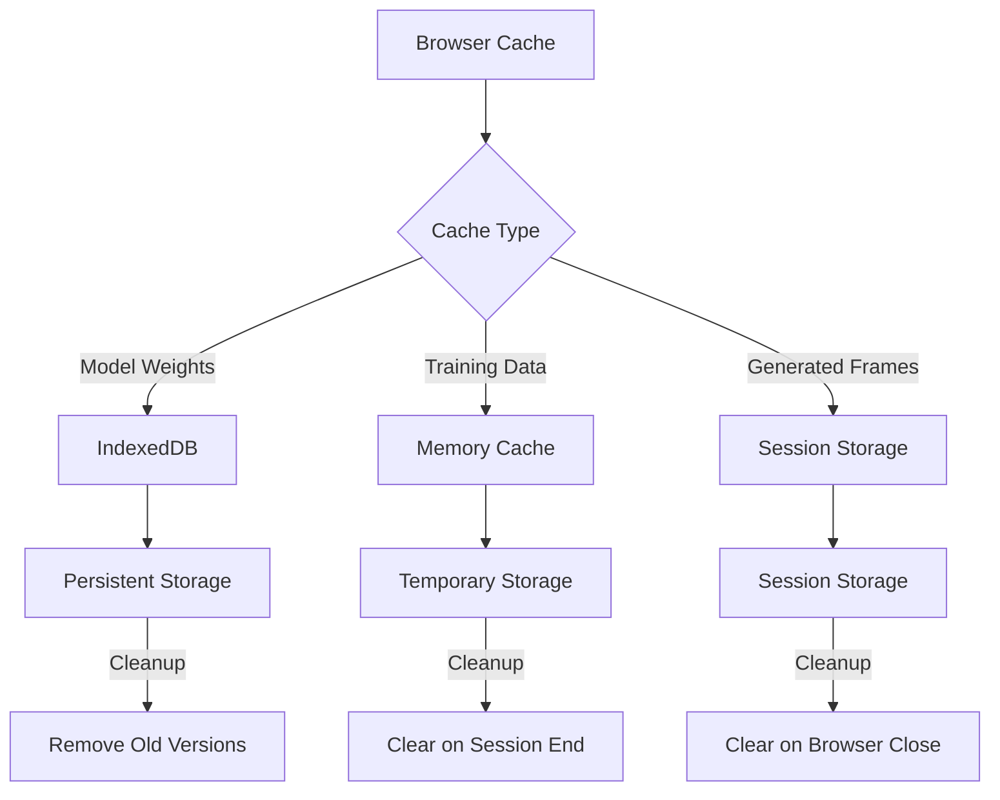
```mermaid
flowchart TD
    A[Browser Cache] --> B{Cache Type}
    B -->|Model Weights| C[IndexedDB]
    B -->|Training Data| D[Memory Cache]
    B -->|Generated Frames| E[Session Storage]
    
    C --> F[Persistent Storage]
    D --> G[Temporary Storage]
    E --> H[Session Storage]
    
    F -->|Cleanup| I[Remove Old Versions]
    G -->|Cleanup| J[Clear on Session End]
    H -->|Cleanup| K[Clear on Browser Close]
```

## 7.3 API DESIGN

### 7.3.1 Module Interface Specifications

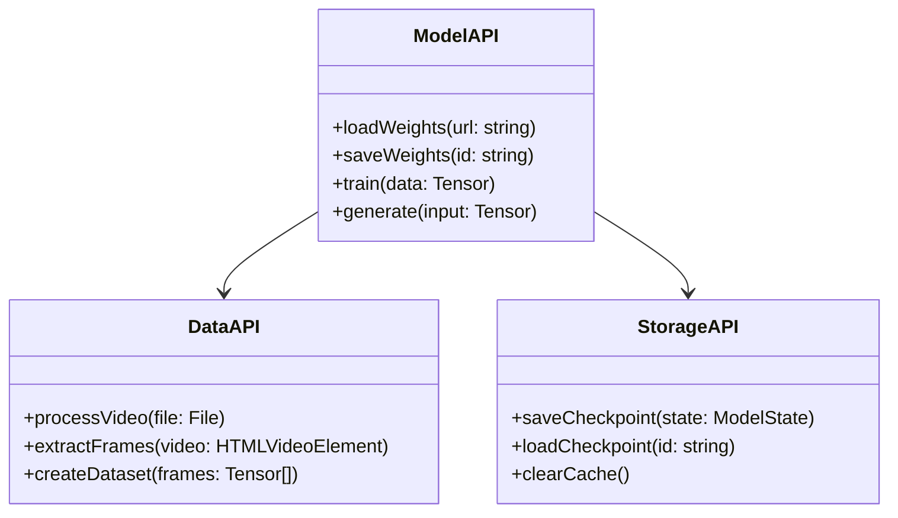
```mermaid
classDiagram
    class ModelAPI {
        +loadWeights(url: string)
        +saveWeights(id: string)
        +train(data: Tensor)
        +generate(input: Tensor)
    }
    
    class DataAPI {
        +processVideo(file: File)
        +extractFrames(video: HTMLVideoElement)
        +createDataset(frames: Tensor[])
    }
    
    class StorageAPI {
        +saveCheckpoint(state: ModelState)
        +loadCheckpoint(id: string)
        +clearCache()
    }
    
    ModelAPI --> DataAPI
    ModelAPI --> StorageAPI
```

### 7.3.2 Internal API Endpoints

| Endpoint | Description | Parameters | Return Type |
|----------|-------------|------------|-------------|
| /model/load | Load model weights | weightUrl: string | Promise<void> |
| /model/save | Save current weights | checkpointId: string | Promise<string> |
| /data/process | Process video input | videoFile: File | Promise<Tensor> |
| /generate | Generate new frames | input: Tensor, actions: Tensor | Promise<Tensor> |

### 7.3.3 WebWorker Communication

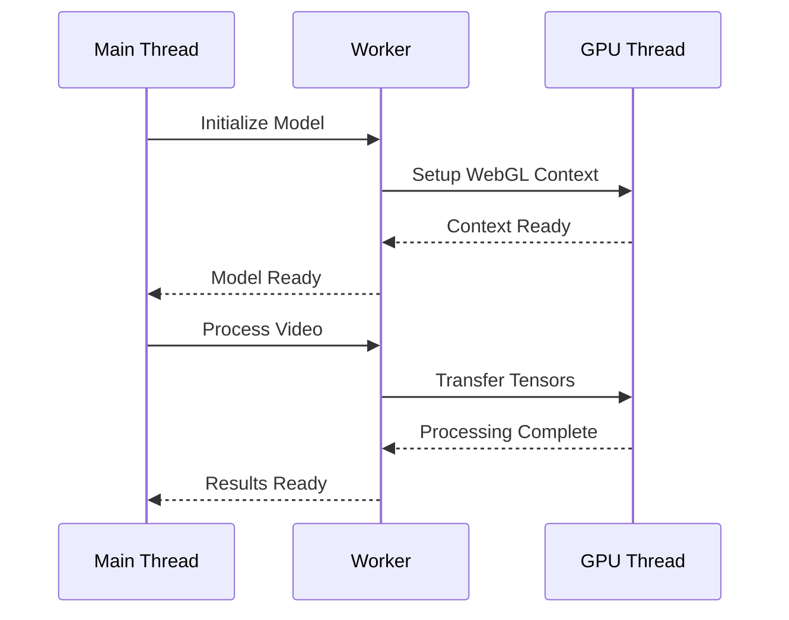
```mermaid
sequenceDiagram
    participant Main Thread
    participant Worker
    participant GPU Thread
    
    Main Thread->>Worker: Initialize Model
    Worker->>GPU Thread: Setup WebGL Context
    GPU Thread-->>Worker: Context Ready
    Worker-->>Main Thread: Model Ready
    
    Main Thread->>Worker: Process Video
    Worker->>GPU Thread: Transfer Tensors
    GPU Thread-->>Worker: Processing Complete
    Worker-->>Main Thread: Results Ready
```

Would you like me to continue with additional sections or provide more detail for any of the existing sections?

Based on the provided context and requirements, I'll generate a comprehensive TECHNOLOGY STACK section that focuses on the browser-based implementation using TensorFlow.js.

# 4. TECHNOLOGY STACK

## 4.1 PROGRAMMING LANGUAGES

| Language | Purpose | Version | Justification |
|----------|----------|----------|--------------|
| JavaScript (ES6+) | Core Implementation | ES2020+ | - Native browser support<br>- TensorFlow.js compatibility<br>- Async/await support |
| WebGL GLSL | GPU Shaders | GLSL ES 3.0 | - Hardware acceleration<br>- TensorFlow.js WebGL backend<br>- Tensor operations |
| HTML5 | Structure/Media | HTML5 | - Video element support<br>- Canvas API<br>- File handling |
| CSS3 | Styling | CSS3 | - Responsive design<br>- Animation support<br>- Modern layouts |

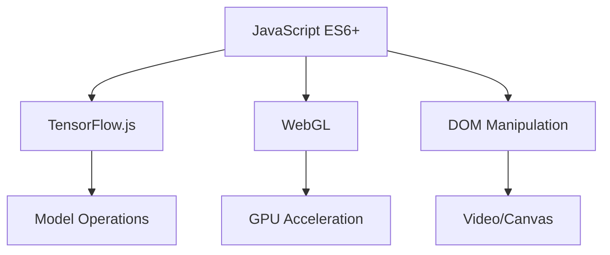
```mermaid
graph TD
    A[JavaScript ES6+] --> B[TensorFlow.js]
    A --> C[WebGL]
    B --> D[Model Operations]
    C --> E[GPU Acceleration]
    A --> F[DOM Manipulation]
    F --> G[Video/Canvas]
```

## 4.2 FRAMEWORKS & LIBRARIES

### Core Libraries

| Library | Version | Purpose | Dependencies |
|---------|----------|----------|--------------|
| TensorFlow.js | 4.x | ML Operations | WebGL 2.0 |
| tfjs-backend-webgl | 4.x | GPU Acceleration | WebGL 2.0 |
| tfjs-converter | 4.x | Model Loading | None |

### Supporting Libraries

| Library | Version | Purpose |
|---------|----------|----------|
| localforage | 1.10.x | IndexedDB Wrapper |
| gl-matrix | 3.x | Matrix Operations |
| comlink | 4.x | WebWorker Communication |

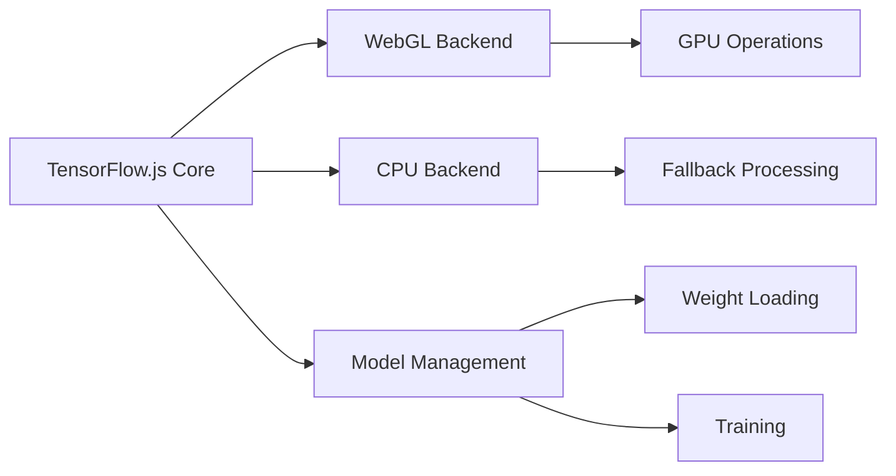
```mermaid
graph LR
    A[TensorFlow.js Core] --> B[WebGL Backend]
    A --> C[CPU Backend]
    B --> D[GPU Operations]
    C --> E[Fallback Processing]
    A --> F[Model Management]
    F --> G[Weight Loading]
    F --> H[Training]
```

## 4.3 DATABASES & STORAGE

### Client-Side Storage

| Storage Type | Purpose | Size Limit | Data Type |
|-------------|----------|------------|------------|
| IndexedDB | Model Weights | 2GB | Binary |
| Cache API | Frame Cache | 500MB | Blob |
| LocalStorage | Settings | 5MB | JSON |

### Persistence Strategy

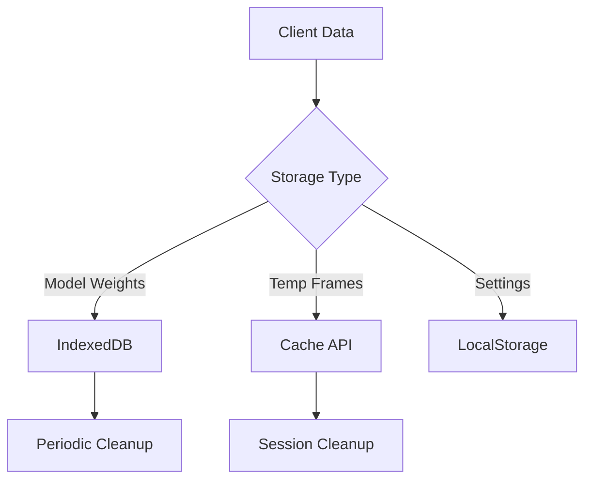
```mermaid
flowchart TD
    A[Client Data] --> B{Storage Type}
    B -->|Model Weights| C[IndexedDB]
    B -->|Temp Frames| D[Cache API]
    B -->|Settings| E[LocalStorage]
    C --> F[Periodic Cleanup]
    D --> G[Session Cleanup]
```

## 4.4 THIRD-PARTY SERVICES

### Development Services

| Service | Purpose | Integration |
|---------|----------|------------|
| GitHub Pages | Static Hosting | Direct |
| NPM | Package Management | Development |
| WebGL Report | Compatibility Check | Runtime |

### Monitoring

| Tool | Purpose | Implementation |
|------|----------|----------------|
| Browser DevTools | Performance Profiling | Built-in |
| TF.js Profiler | Model Performance | TF.js API |
| Memory Inspector | Heap Analysis | Chrome DevTools |

## 4.5 DEVELOPMENT & DEPLOYMENT

### Development Environment

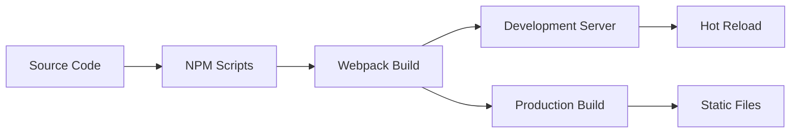
```mermaid
flowchart LR
    A[Source Code] --> B[NPM Scripts]
    B --> C[Webpack Build]
    C --> D[Development Server]
    D --> E[Hot Reload]
    C --> F[Production Build]
    F --> G[Static Files]
```

### Build System

| Tool | Version | Purpose |
|------|----------|----------|
| Webpack | 5.x | Module Bundling |
| Babel | 7.x | JS Compilation |
| ESLint | 8.x | Code Quality |
| Jest | 29.x | Testing |

### Deployment Pipeline

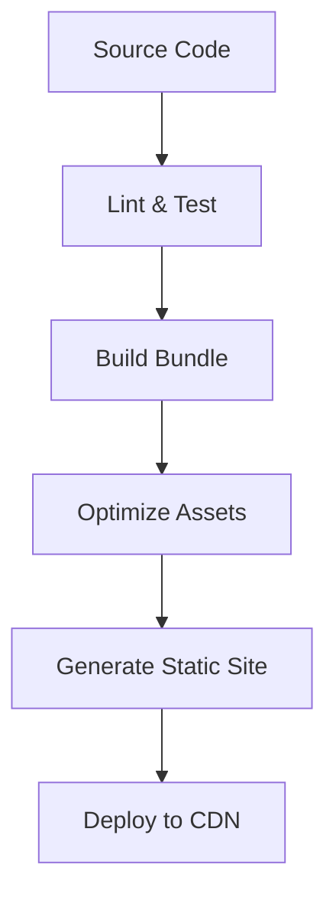
```mermaid
flowchart TD
    A[Source Code] --> B[Lint & Test]
    B --> C[Build Bundle]
    C --> D[Optimize Assets]
    D --> E[Generate Static Site]
    E --> F[Deploy to CDN]
```

### Development Tools

| Category | Tools | Purpose |
|----------|-------|----------|
| IDE | VSCode + Extensions | Development |
| Browser | Chrome DevTools | Debugging |
| Version Control | Git | Source Control |
| Documentation | JSDoc | API Docs |

This technology stack is specifically designed for browser-based ML implementation, prioritizing:

1. Client-side processing capabilities
2. GPU acceleration through WebGL
3. Efficient memory management
4. Cross-browser compatibility
5. Modern web standards compliance

The stack maintains consistency with the architectural decisions outlined in previous sections while ensuring all components work together to support the video game diffusion model's requirements.

I'll generate a comprehensive SYSTEM DESIGN section for the browser-based video game diffusion model using TensorFlow.js.

# 5. SYSTEM DESIGN

## 5.1 USER INTERFACE DESIGN

### 5.1.1 Design Specifications

| Category | Requirement |
|----------|-------------|
| Visual Hierarchy | Material Design principles with ML-specific components |
| Component Library | Custom TensorFlow.js compatible UI components |
| Responsive Design | Fluid layouts supporting 1280x720 to 4K resolutions |
| Accessibility | WCAG 2.1 Level AA compliance |
| Browser Support | Chrome 90+, Firefox 88+, Safari 14+, Edge 90+ |
| Theme Support | Light/Dark mode with ML-specific color schemes |
| Internationalization | English-only for initial release |

### 5.1.2 Interface Layout

```mermaid
graph TD
    subgraph Main Interface
        A[Header Navigation] --> B[Model Controls]
        B --> C[Video Upload]
        B --> D[Training Controls]
        B --> E[Generation Controls]
        
        subgraph Workspace
            F[Video Preview] --> G[Frame Display]
            G --> H[Action Controls]
            H --> I[Generation Preview]
        end
        
        subgraph Status
            J[Training Progress]
            K[Resource Usage]
            L[Error Display]
        end
    end
```

### 5.1.3 Critical User Flows

```mermaid
stateDiagram-v2
    [*] --> Upload
    Upload --> ProcessVideo
    ProcessVideo --> ConfigureModel
    ConfigureModel --> Train
    Train --> Generate
    Generate --> Preview
    Preview --> Adjust
    Adjust --> Generate
    Generate --> Export
    Export --> [*]

    state ProcessVideo {
        [*] --> ValidateFormat
        ValidateFormat --> ExtractFrames
        ExtractFrames --> CreateTensors
    }

    state Train {
        [*] --> InitializeModel
        InitializeModel --> BatchProcess
        BatchProcess --> UpdateWeights
        UpdateWeights --> SaveCheckpoint
    }
```

### 5.1.4 Component Specifications

| Component | Description | States | Validation Rules |
|-----------|-------------|--------|------------------|
| Video Upload | Drag-drop or file select | idle, uploading, processing, error | Format: MP4/WebM, Size: <100MB |
| Training Progress | Visual progress indicator | training, paused, completed, error | N/A |
| Frame Preview | Canvas-based frame display | loading, playing, paused, error | WebGL context required |
| Action Controls | Game action input interface | active, disabled | Valid action range check |
| Resource Monitor | GPU/Memory usage display | normal, warning, critical | Update every 1s |

## 5.2 DATABASE DESIGN

### 5.2.1 Client-Side Storage Schema

```mermaid
erDiagram
    ModelWeights ||--o{ Checkpoint : contains
    ModelWeights {
        string id
        blob weights
        string version
        timestamp created
    }
    Checkpoint {
        string id
        blob state
        int step
        timestamp created
    }
    TrainingData ||--o{ Frame : contains
    TrainingData {
        string id
        string videoId
        array actions
        timestamp created
    }
    Frame {
        string id
        blob data
        int sequence
        array metadata
    }
```

### 5.2.2 IndexedDB Structure

| Store Name | Key | Indexes | Data Type | Retention |
|------------|-----|---------|-----------|-----------|
| modelWeights | id | version, created | Blob | Permanent |
| checkpoints | id | step, created | Blob | 7 days |
| trainingData | id | videoId, created | JSON | Session |
| frames | id | sequence | Blob | Session |

### 5.2.3 Caching Strategy

```mermaid
flowchart TD
    A[Browser Cache] --> B{Cache Type}
    B -->|Model Weights| C[IndexedDB]
    B -->|Training Data| D[Memory Cache]
    B -->|Generated Frames| E[Session Storage]
    
    C --> F[Persistent Storage]
    D --> G[Temporary Storage]
    E --> H[Session Storage]
    
    F -->|Cleanup| I[Remove Old Versions]
    G -->|Cleanup| J[Clear on Session End]
    H -->|Cleanup| K[Clear on Browser Close]
```

## 5.3 API DESIGN

### 5.3.1 Module Interface Specifications

```mermaid
classDiagram
    class ModelAPI {
        +loadWeights(url: string)
        +saveWeights(id: string)
        +train(data: Tensor)
        +generate(input: Tensor)
    }
    
    class DataAPI {
        +processVideo(file: File)
        +extractFrames(video: HTMLVideoElement)
        +createDataset(frames: Tensor[])
    }
    
    class StorageAPI {
        +saveCheckpoint(state: ModelState)
        +loadCheckpoint(id: string)
        +clearCache()
    }
    
    ModelAPI --> DataAPI
    ModelAPI --> StorageAPI
```

### 5.3.2 Internal API Endpoints

| Endpoint | Description | Parameters | Return Type |
|----------|-------------|------------|-------------|
| /model/load | Load model weights | weightUrl: string | Promise<void> |
| /model/save | Save current weights | checkpointId: string | Promise<string> |
| /data/process | Process video input | videoFile: File | Promise<Tensor> |
| /generate | Generate new frames | input: Tensor, actions: Tensor | Promise<Tensor> |

### 5.3.3 WebWorker Communication

```mermaid
sequenceDiagram
    participant Main Thread
    participant Worker
    participant GPU Thread
    
    Main Thread->>Worker: Initialize Model
    Worker->>GPU Thread: Setup WebGL Context
    GPU Thread-->>Worker: Context Ready
    Worker-->>Main Thread: Model Ready
    
    Main Thread->>Worker: Process Video
    Worker->>GPU Thread: Transfer Tensors
    GPU Thread-->>Worker: Processing Complete
    Worker-->>Main Thread: Results Ready
```

Would you like me to expand on any of these sections or provide additional details?

# 6. USER INTERFACE DESIGN

## 6.1 Overview

The browser-based video game diffusion model requires a clean, functional interface that allows users to upload videos, configure training parameters, and view generated results. The UI is designed to work within modern web browsers and integrate with TensorFlow.js processing.

## 6.2 Symbol Key

```
Icons:
[?] - Help/Documentation
[^] - Upload
[>] - Start/Play
[||] - Pause
[x] - Close/Clear
[!] - Warning/Error
[=] - Settings
[#] - Dashboard
[@] - User Profile
[*] - Processing/Active

Components:
[ ] - Checkbox
( ) - Radio Button
[...] - Text Input
[Button] - Action Button
[====] - Progress Bar
[v] - Dropdown Menu
```

## 6.3 Main Dashboard

```
+----------------------------------------------------------+
|                  Video Game DiT Training                   |
|  [@] Profile    [#] Dashboard    [?] Help    [=] Settings |
+----------------------------------------------------------+
|                                                           |
|  [^] Upload Video                                         |
|  +--------------------------------------------------+    |
|  |                                                   |    |
|  |          Drag and drop video file here           |    |
|  |               or click to browse                  |    |
|  |                                                   |    |
|  +--------------------------------------------------+    |
|                                                           |
|  Training Parameters:                                     |
|  +--------------------------------------------------+    |
|  | Batch Size:    [...4]                             |    |
|  | Learning Rate: [...0.001]                         |    |
|  | Epochs:        [...10]                            |    |
|  | Model Size:    [v Large (1024)] [?]              |    |
|  +--------------------------------------------------+    |
|                                                           |
|  [Start Training]                                         |
|                                                           |
+----------------------------------------------------------+
```

## 6.4 Training Progress View

```
+----------------------------------------------------------+
|                  Training Progress                         |
+----------------------------------------------------------+
|                                                           |
|  Current Status: [* Training in Progress]                 |
|                                                           |
|  Progress:                                                |
|  [===============================          ] 70%           |
|                                                           |
|  Metrics:                                                 |
|  +--------------------------------------------------+    |
|  | Loss:        0.0234                               |    |
|  | Time Left:   5:23                                 |    |
|  | Batch:       45/100                               |    |
|  | Memory Use:  3.2GB                                |    |
|  +--------------------------------------------------+    |
|                                                           |
|  [Pause Training] [Stop Training]                         |
|                                                           |
+----------------------------------------------------------+
```

## 6.5 Generation Interface

```
+----------------------------------------------------------+
|                  Video Generation                          |
+----------------------------------------------------------+
|                                                           |
|  Source Video:                 Generated Output:          |
|  +----------------+           +----------------+          |
|  |                |           |                |          |
|  |    [>] Play    |           |   [>] Play     |          |
|  |                |           |                |          |
|  +----------------+           +----------------+          |
|                                                           |
|  Action Controls:                                         |
|  +--------------------------------------------------+    |
|  | Movement:                                         |    |
|  | ( ) Forward  ( ) Back  ( ) Left  ( ) Right       |    |
|  |                                                   |    |
|  | Camera:                                          |    |
|  | X: [-50=====|=====50]  Y: [-50=====|=====50]    |    |
|  |                                                   |    |
|  | Interaction:                                      |    |
|  | [ ] Jump  [ ] Attack  [ ] Use Item               |    |
|  +--------------------------------------------------+    |
|                                                           |
|  [Generate Frame] [Export Video]                          |
|                                                           |
+----------------------------------------------------------+
```

## 6.6 Settings Panel

```
+----------------------------------------------------------+
|                  Settings                            [x]   |
+----------------------------------------------------------+
|                                                           |
|  Performance:                                             |
|  +--------------------------------------------------+    |
|  | GPU Acceleration:     [v] Enabled                 |    |
|  | Max Memory Usage:     [...4] GB                   |    |
|  | Processing Priority:  [v High]                    |    |
|  +--------------------------------------------------+    |
|                                                           |
|  Model Configuration:                                     |
|  +--------------------------------------------------+    |
|  | Architecture:        [v DiT-L/2]                  |    |
|  | VAE Type:           [v SD-VAE]                    |    |
|  | Action Embedding:    [v Learned]                  |    |
|  +--------------------------------------------------+    |
|                                                           |
|  Export Settings:                                         |
|  +--------------------------------------------------+    |
|  | Format:             [v MP4]                       |    |
|  | Resolution:         [v 256x256]                   |    |
|  | Frame Rate:         [...30] fps                   |    |
|  +--------------------------------------------------+    |
|                                                           |
|  [Save Settings] [Reset to Defaults]                      |
|                                                           |
+----------------------------------------------------------+
```

## 6.7 Responsive Design Notes

- Interface scales to minimum width of 1280px
- Components reflow on mobile devices
- Touch-friendly controls for tablet use
- Maintains 16:9 aspect ratio for video displays
- Progress bars and controls adapt to available width
- Modals center on all screen sizes

## 6.8 Interaction States

- Upload area highlights on drag-over
- Progress bars animate during processing
- Buttons show loading state during operations
- Error states display with red highlights
- Success states display with green highlights
- Help tooltips appear on hover
- Controls disable during processing

I'll generate a comprehensive SECURITY CONSIDERATIONS section that aligns with the browser-based video game diffusion model implementation using TensorFlow.js.

# 7. SECURITY CONSIDERATIONS

## 7.1 AUTHENTICATION AND AUTHORIZATION

### 7.1.1 Authentication Flow

```mermaid
sequenceDiagram
    participant User
    participant Browser
    participant LocalStorage
    participant ModelAPI

    User->>Browser: Access Application
    Browser->>LocalStorage: Check Session
    alt Has Valid Session
        LocalStorage-->>Browser: Return Session
        Browser->>ModelAPI: Access Granted
    else No Valid Session
        Browser->>User: Request Authentication
        User->>Browser: Provide Credentials
        Browser->>LocalStorage: Store Session
        Browser->>ModelAPI: Access Granted
    end
```

### 7.1.2 Authorization Levels

| Role | Description | Permissions |
|------|-------------|-------------|
| Viewer | Basic user access | - View generated content<br>- Use pre-trained models |
| Creator | Content generation | - Upload videos<br>- Generate new content<br>- Save outputs |
| Trainer | Model training | - Train models<br>- Modify parameters<br>- Export weights |
| Admin | Full system access | - All permissions<br>- Manage users<br>- Configure system |

## 7.2 DATA SECURITY

### 7.2.1 Client-Side Data Protection

```mermaid
flowchart TD
    A[User Data] --> B{Data Type}
    B -->|Model Weights| C[IndexedDB]
    B -->|Video Frames| D[Memory]
    B -->|Settings| E[LocalStorage]
    
    C --> F[Encrypted Storage]
    D --> G[Secure Memory]
    E --> H[Session Storage]
    
    F --> I[Access Control]
    G --> J[Memory Cleanup]
    H --> K[Session Management]
```

### 7.2.2 Data Handling Policies

| Data Type | Storage Location | Protection Method | Retention Period |
|-----------|------------------|-------------------|------------------|
| Video Input | Browser Memory | In-memory encryption | Session only |
| Model Weights | IndexedDB | AES-256 encryption | Until explicit deletion |
| Generated Frames | WebGL Buffer | Secure context | Session only |
| User Settings | LocalStorage | JSON encryption | 30 days |
| Training Data | Memory | Secure context | Session only |

## 7.3 SECURITY PROTOCOLS

### 7.3.1 Browser Security Requirements

```mermaid
flowchart LR
    A[Security Context] --> B{Requirements}
    B --> C[Secure Origin]
    B --> D[HTTPS]
    B --> E[CSP Headers]
    
    C --> F[Protocol Check]
    D --> G[TLS 1.3]
    E --> H[Policy Enforcement]
    
    F --> I[Security Status]
    G --> I
    H --> I
```

### 7.3.2 Resource Protection

| Resource | Protection Mechanism | Implementation |
|----------|---------------------|----------------|
| WebGL Context | Context isolation | Dedicated canvas element |
| Model Weights | Checksum verification | SHA-256 hash validation |
| Video Data | Memory isolation | Separate WebWorker context |
| User Input | Input sanitization | XSS prevention filters |
| API Access | Origin validation | CORS policy enforcement |

### 7.3.3 Security Monitoring

```mermaid
sequenceDiagram
    participant App
    participant Monitor
    participant Handler
    
    loop Every 1s
        App->>Monitor: Check Memory Usage
        App->>Monitor: Check GPU Status
        App->>Monitor: Verify Context
    end
    
    alt Security Violation
        Monitor->>Handler: Report Issue
        Handler->>App: Take Action
    else Normal Operation
        Monitor->>App: Continue
    end
```

### 7.3.4 Implementation Guidelines

| Category | Requirement | Implementation |
|----------|-------------|----------------|
| Code Security | Prevent XSS | - Content Security Policy<br>- Input validation<br>- Output encoding |
| Memory Security | Prevent leaks | - Tensor disposal<br>- WebGL cleanup<br>- Regular GC |
| Context Security | Isolate execution | - Separate workers<br>- Sandboxed frames<br>- Secure contexts |
| Data Security | Protect user data | - Client-side encryption<br>- Secure storage<br>- Data minimization |

### 7.3.5 Error Handling

```mermaid
flowchart TD
    A[Security Error] --> B{Error Type}
    B -->|Memory| C[Release Resources]
    B -->|Context| D[Reset Context]
    B -->|Access| E[Block Operation]
    
    C --> F[Log Error]
    D --> F
    E --> F
    
    F --> G[Notify User]
    G --> H[Recovery Action]
```

This security considerations section ensures that the browser-based implementation maintains high security standards while working within the constraints of client-side processing and browser security models. The focus is on protecting user data, ensuring secure execution contexts, and maintaining proper resource isolation.

Would you like me to expand on any particular aspect of the security considerations?

I'll generate a comprehensive INFRASTRUCTURE section that aligns with the browser-based video game diffusion model implementation using TensorFlow.js.

# 8. INFRASTRUCTURE

## 8.1 DEPLOYMENT ENVIRONMENT

The system is primarily client-side, running entirely in web browsers, with minimal server infrastructure required for static file hosting.

```mermaid
flowchart TD
    subgraph Client Environment
        A[Web Browser] --> B[TensorFlow.js Runtime]
        B --> C[WebGL Backend]
        B --> D[CPU Backend]
        A --> E[Local Storage]
        E --> F[IndexedDB]
        E --> G[Cache API]
    end
    
    subgraph Static Hosting
        H[CDN] --> I[Model Weights]
        H --> J[Static Assets]
        H --> K[HTML/JS/CSS]
    end
    
    H --> A
```

### Environment Requirements

| Component | Requirement | Purpose |
|-----------|-------------|----------|
| Browser | Modern (Chrome 90+, Firefox 88+, Safari 14+) | TensorFlow.js compatibility |
| WebGL | Version 2.0+ | GPU acceleration |
| Memory | 4GB+ available | Model operations |
| Storage | 2GB+ available | Model weights and caching |
| Network | 10Mbps+ | Initial asset download |

## 8.2 CLOUD SERVICES

Minimal cloud services required, focused on static content delivery and optional analytics.

```mermaid
flowchart LR
    subgraph Cloud Services
        A[CloudFront CDN] --> B[S3 Static Hosting]
        C[Cloud Analytics] --> D[Usage Metrics]
        C --> E[Performance Data]
    end
    
    subgraph Optional Services
        F[Model Registry] --> G[Weight Storage]
        H[Monitoring] --> I[Error Tracking]
    end
    
    B --> J[Static Assets]
    G --> K[Model Versions]
```

| Service | Provider | Purpose | Justification |
|---------|----------|---------|---------------|
| CDN | CloudFront | Static file delivery | Global low-latency access |
| Storage | S3 | Model weight hosting | Cost-effective, scalable |
| Analytics | Google Analytics | Usage tracking | Free tier available |
| Error Tracking | Sentry | Client-side monitoring | Browser-focused tracking |

## 8.3 CONTAINERIZATION

Development environment containerization only; production runs in browser context.

```mermaid
flowchart TD
    subgraph Development Container
        A[Node.js Environment] --> B[Development Server]
        B --> C[Hot Reloading]
        A --> D[Build Tools]
        D --> E[Webpack]
        D --> F[Babel]
    end
    
    subgraph Production
        G[Browser Runtime] --> H[No Container]
    end
```

### Development Container Specification

```dockerfile
FROM node:16
WORKDIR /app
COPY package*.json ./
RUN npm install
COPY . .
EXPOSE 3000
CMD ["npm", "start"]
```

## 8.4 ORCHESTRATION

No traditional orchestration required due to client-side nature. Browser handles resource management.

### Resource Management

```mermaid
flowchart TD
    subgraph Browser Orchestration
        A[Resource Manager] --> B[Memory Management]
        A --> C[GPU Resources]
        A --> D[Worker Threads]
        
        B --> E[Tensor Cleanup]
        C --> F[WebGL Context]
        D --> G[Task Distribution]
    end
```

## 8.5 CI/CD PIPELINE

```mermaid
flowchart LR
    A[Source Code] --> B[GitHub Actions]
    B --> C[Build]
    C --> D[Test]
    D --> E[Lint]
    E --> F[Bundle]
    F --> G[Deploy to CDN]
    
    subgraph Testing
        H[Unit Tests]
        I[Integration Tests]
        J[Browser Tests]
    end
    
    D --> H
    D --> I
    D --> J
```

### Pipeline Stages

| Stage | Tools | Purpose |
|-------|-------|---------|
| Source Control | GitHub | Version control |
| CI Platform | GitHub Actions | Automation |
| Building | Webpack | Asset bundling |
| Testing | Jest, Cypress | Validation |
| Linting | ESLint | Code quality |
| Deployment | AWS CLI | CDN publishing |

### Deployment Process

```yaml
name: Deploy
on:
  push:
    branches: [main]
jobs:
  deploy:
    runs-on: ubuntu-latest
    steps:
      - uses: actions/checkout@v2
      - name: Setup Node.js
        uses: actions/setup-node@v2
        with:
          node-version: '16'
      - run: npm install
      - run: npm test
      - run: npm run build
      - name: Deploy to CDN
        run: |
          aws s3 sync dist/ s3://your-bucket/
          aws cloudfront create-invalidation --distribution-id YOUR_ID
```

### Monitoring and Rollback

```mermaid
flowchart TD
    A[Deployment] --> B{Health Check}
    B -->|Pass| C[Live]
    B -->|Fail| D[Rollback]
    D --> E[Previous Version]
    
    subgraph Monitoring
        F[Error Rate]
        G[Performance]
        H[Usage]
    end
    
    C --> F
    C --> G
    C --> H
```

This infrastructure setup prioritizes client-side performance while maintaining minimal server dependencies, aligning with the browser-based nature of the application. The CI/CD pipeline ensures reliable deployments while the monitoring system helps maintain service quality.

I'll generate a comprehensive APPENDICES section that captures additional technical information, glossary terms, and acronyms while maintaining consistency with the established TensorFlow.js implementation context.

# APPENDICES

## A.1 Additional Technical Information

### A.1.1 Model Architecture Details

```mermaid
graph TD
    subgraph DiT Architecture
        A[Input Frame] --> B[Patch Embedding]
        B --> C[Temporal Attention]
        C --> D[Spatial Attention]
        D --> E[MLP Block]
        E --> F[Layer Norm]
        F --> G[Output Frame]
    end

    subgraph VAE Components
        H[Input] --> I[Encoder]
        I --> J[Latent Space]
        J --> K[Decoder]
        K --> L[Output]
    end

    subgraph Action Processing
        M[Raw Input] --> N[Action Embedding]
        N --> O[Temporal Encoding]
        O --> P[Condition Vector]
    end
```

### A.1.2 Memory Management Strategy

| Component | Memory Allocation | Cleanup Strategy | Priority |
|-----------|------------------|------------------|-----------|
| Video Frames | Dynamic allocation | Immediate disposal after processing | High |
| Model Weights | Persistent storage | Cache with versioning | Medium |
| Temporary Tensors | WebGL buffers | Auto-dispose after operations | High |
| Generated Frames | Canvas buffers | Clear on new generation | Medium |

### A.1.3 Browser Optimization Techniques

```mermaid
mindmap
    root((Browser Optimization))
        WebGL
            Context Preservation
            Shader Compilation
            Buffer Management
        Memory
            Tensor Disposal
            Garbage Collection
            Cache Strategy
        Threading
            Web Workers
            Main Thread
            Async Operations
        Resources
            Lazy Loading
            Progressive Enhancement
            Resource Pooling
```

## A.2 GLOSSARY

| Term | Definition |
|------|------------|
| Attention Block | Neural network component that weighs importance of different input elements |
| Batch Processing | Technique of processing multiple samples simultaneously |
| Denoising | Process of removing noise from data in diffusion models |
| Embedding | Dense vector representation of discrete or continuous data |
| Frame Extraction | Process of obtaining individual frames from video |
| Latent Vector | Compressed representation in the model's learned space |
| Patch Embedding | Technique of dividing and embedding image patches |
| Tensor | Multi-dimensional array used in deep learning |
| WebGL Context | Graphics processing context for GPU acceleration |
| Zero-shot | Ability to handle unseen scenarios without specific training |

## A.3 ACRONYMS

| Acronym | Expansion |
|---------|-----------|
| API | Application Programming Interface |
| BVGDM | Browser-based Video Game Diffusion Model |
| CSP | Content Security Policy |
| DiT | Diffusion Transformer |
| FPS | Frames Per Second |
| GPU | Graphics Processing Unit |
| HTML | HyperText Markup Language |
| IndexedDB | Indexed Database API |
| JS | JavaScript |
| MLP | Multi-Layer Perceptron |
| PSNR | Peak Signal-to-Noise Ratio |
| RAM | Random Access Memory |
| TF.js | TensorFlow.js |
| UI/UX | User Interface/User Experience |
| VAE | Variational Autoencoder |
| WebGL | Web Graphics Library |
| XSS | Cross-Site Scripting |

## A.4 Implementation Dependencies

```mermaid
graph LR
    A[TensorFlow.js] --> B[Core Implementation]
    C[WebGL] --> B
    D[Browser APIs] --> B
    
    subgraph Required Libraries
        A
        E[gl-matrix]
        F[localforage]
    end
    
    subgraph Browser Features
        C
        G[Web Workers]
        H[IndexedDB]
    end
    
    subgraph APIs
        D
        I[File System]
        J[Canvas]
    end
```

## A.5 Performance Metrics

| Metric | Target Value | Measurement Method |
|--------|--------------|-------------------|
| Frame Generation Time | <50ms | Performance.now() |
| Memory Usage | <4GB | Performance Monitor |
| GPU Utilization | <80% | WebGL Profiler |
| Model Load Time | <5s | Custom Timer |
| Training Step Time | <200ms | Performance.now() |

This APPENDICES section provides additional context and clarification for the technical implementation while maintaining consistency with the browser-based approach using TensorFlow.js. The diagrams and tables help visualize complex relationships and organize important information for reference.