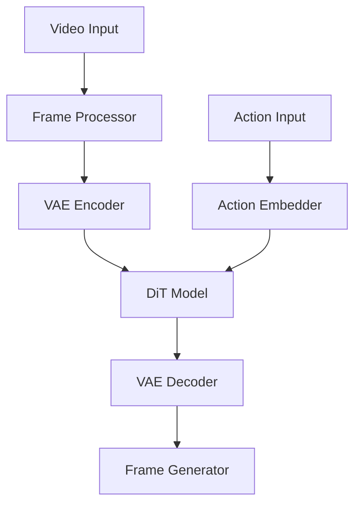

# Browser-Based Video Game Diffusion Model (BVGDM) Web Frontend

[](https://github.com/yourusername/bvgdm/actions)
[](https://david-dm.org/yourusername/bvgdm)
[](LICENSE)
[](README.md#browser-compatibility)
[](README.md#performance-metrics)

Advanced browser-based implementation of the Video Game Diffusion Model using TensorFlow.js with WebGL acceleration.

## Features

- 🚀 Real-time video frame generation (<50ms per frame)
- 🧠 Client-side model training with WebGL acceleration
- 🎥 Browser-based video processing and frame extraction
- 🎮 Action-conditioned generation interface
- 💾 Memory-optimized tensor operations
- 📱 Responsive UI with real-time previews
- 🔄 Automatic WebGL context management
- 🧹 Progressive memory cleanup
- 🌐 Browser-specific optimizations
- 📊 Performance monitoring and reporting

## Browser Compatibility

| Browser | Version | WebGL | Minimum Memory |
|---------|---------|-------|----------------|
| Chrome  | 90+     | 2.0   | 4GB           |
| Firefox | 88+     | 2.0   | 4GB           |
| Safari  | 14+     | 2.0   | 4GB           |
| Edge    | 90+     | 2.0   | 4GB           |

## Getting Started

### Prerequisites

```bash
# Required Node.js version
node >= 16.0.0

# Required npm version
npm >= 7.0.0
```

### Installation

```bash
# Install dependencies
npm install

# Start development server
npm run dev

# Build for production
npm run build
```

## Architecture

The BVGDM web frontend implements a fully client-side machine learning pipeline:



## Performance Guidelines

### Memory Management

- Implement tensor disposal after each operation
- Monitor WebGL context state
- Schedule regular garbage collection
- Use performance monitoring APIs

### Optimization Techniques

- Enable WebGL acceleration when available
- Implement batch processing for training
- Utilize Web Workers for heavy computations
- Pool and reuse resources

## Security Considerations

### Data Handling
- All processing occurs client-side
- No data transmission to external servers
- Secure WebGL context isolation
- Comprehensive resource cleanup

### Browser Security
- Content Security Policy (CSP) implementation
- Cross-Origin Resource Sharing (CORS) handling
- Secure context requirements
- Memory isolation patterns

## Troubleshooting

### Common Issues

1. Memory Leaks
   - Symptom: Increasing memory usage
   - Solution: Verify tensor disposal patterns
   - Prevention: Implement cleanup hooks

2. WebGL Context Loss
   - Symptom: Rendering stops
   - Solution: Implement context restoration
   - Prevention: Regular context state checks

3. Performance Degradation
   - Symptom: Increased inference time
   - Solution: Check resource utilization
   - Prevention: Regular performance monitoring

## Performance Metrics

| Metric | Target | Measurement Method |
|--------|--------|-------------------|
| Frame Generation | <50ms | `performance.now()` |
| Memory Usage | <4GB | Performance Monitor |
| GPU Utilization | <80% | WebGL Profiler |
| Model Load Time | <5s | Custom Timer |
| Training Step | <200ms | `performance.now()` |

## Development

### Environment Setup

```bash
# Install development dependencies
npm install --save-dev

# Run tests
npm test

# Run linting
npm run lint

# Generate documentation
npm run docs
```

### Project Structure

```
src/web/
├── components/     # UI components
├── models/        # ML model implementations
├── utils/         # Utility functions
├── workers/       # Web Workers
├── styles/        # CSS/SCSS files
└── tests/         # Test suites
```

## Contributing

1. Fork the repository
2. Create your feature branch (`git checkout -b feature/AmazingFeature`)
3. Commit your changes (`git commit -m 'Add some AmazingFeature'`)
4. Push to the branch (`git push origin feature/AmazingFeature`)
5. Open a Pull Request

## License

This project is licensed under the MIT License - see the [LICENSE](LICENSE) file for details.

## Acknowledgments

- TensorFlow.js team for the WebGL backend implementation
- Browser vendors for WebGL support
- Open source community for various utilities and tools

## Contact

Project Link: [https://github.com/yourusername/bvgdm](https://github.com/yourusername/bvgdm)